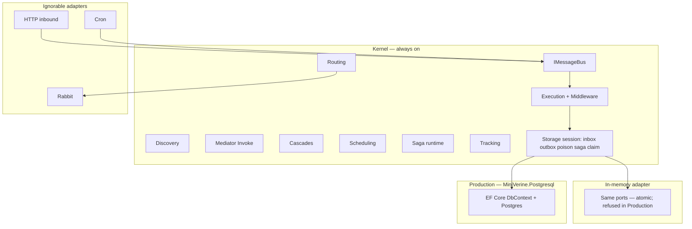
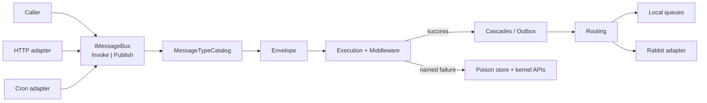
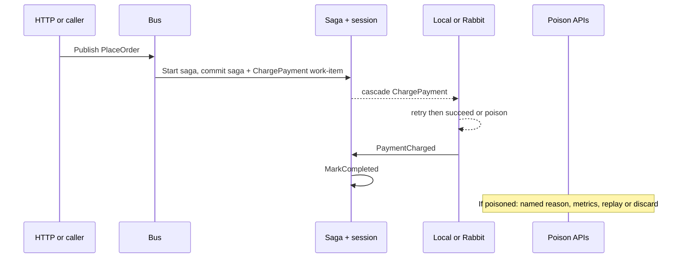

# Spec: MiniVerine 12-month inspectable kernel

Locked 2026-09-01. Personality: **inspectable kernel** — tiny public API; catalogs, validators, and named errors are the brand. Rabbit, HTTP, and cron are adapters you can ignore.

This is the 12-month north star, not a single PR. Implementation follows README slice order plus the rigor tasks in [Implementation Tasks](#implementation-tasks). Do not treat this document as permission to clone Wolverine’s catalog.

---

## 1. Outcomes & Why

Wolverine is the best general .NET bus you do not own: source-gen, JasperFx gravity, hard to read when an envelope dies. AsyncMonolith is the bus StoreboostServices actually runs: EF outbox, cron, poison table, multi-instance pollers — and it is too small (no sagas, no mediator, weak discovery, weak operator story).

MiniVerine’s job is **not** to match Wolverine’s catalog. It is to be the bus an OSS team (and later Storeboost) chooses **because they can read, debug, and change it**. StoreboostServices is the first customer, not the design owner: it lives with the general API and rewrites `BaseConsumer` / MediatR handlers.

**Success in 12 months**

- An engineer or coding agent can follow one envelope from `Publish` → handler → cascade → poison **without generated code**.
- Default answer to “why not Wolverine?” is: **we own the kernel; it is small; failures have names.**
- Storeboost can move **one** AsyncMonolith path onto MiniVerine `Publish` + EF durability without MiniVerine gaining Storeboost types.

**Why now:** Domain Envelope / Messaging / Sagas already encode this bet (typed unknown messages, validators, no I/O). Application is unbuilt. This spec stops the README from becoming a Wolverine clone.

## 2. Scope

**In (12-month product):**

- Kernel bus: Discovery, Bus (`Invoke` / `Publish`), Mediator, Cascades, Routing, Execution, Middleware, Scheduling, Application/Sagas, Tracking
- One handler model: convention `Handle` / `HandleAsync` / `Consume` / `Start` + cascading return values
- Handlers are instance types; dependencies via **constructor only**. Method parameters: message, `CancellationToken`, optionally `Envelope` / storage session
- Unified bus: `Invoke` replaces MediatR; `Publish` replaces AsyncMonolith (SBS may adopt Publish first)
- EF Core production store: inbox, outbox, poison/DLQ, saga store; in-memory for tests
- One storage **session per handling**: inbox + saga + outbox in one transaction (in-memory must be atomic too)
- Inbox **work-item per handler** (fan-out = isolated claimable rows)
- Multi-instance claim/lease **by default**; `Solo` is explicit opt-in for tests and the Helpdesk console
- Adapters (ignorable): RabbitMQ, HTTP inbound front door, recurring cron
- Operator story: named poison reasons, OpenTelemetry, replay/discard **kernel** APIs (no SPA, no CLI, not mapped by `MiniVerine.Http`)
- Optional Publish idempotency key; bus-assigned ConversationId / CorrelationId; never log envelope bodies by default
- Helpdesk sample as the teaching conversation (`PlaceOrder` / `ChargePayment` / timeout)

**Out (this 12 months):**

- Source generators
- Marten / JasperFx
- Extra brokers (Azure Service Bus, SQS, Kafka, productized TCP)
- MassTransit / NServiceBus / MediatR shims
- Admin SPA or `dotnet` poison CLI
- Dual handler model (`BaseConsumer` adapter)
- Wolverine-style method-parameter DI
- HTTP-mapped poison endpoints
- Wolverine wire compatibility
- Throughput race with Wolverine

**Deferred (named follow-up, after the kernel holds):**

- More brokers
- Marten adapter only if it cannot leak into core
- Poison CLI
- Agent-native extras (eval suites, handler scaffolding) if inspectability still wins
- StoreboostServices adoption playbook (other repo): Publish-first, one consumer, AsyncMonolith remains until proven

## 3. Constraints

- Onion: Domain has no I/O; Application has ports only; adapters are separate projects; core must not reference Rabbit/HTTP/EF packages
- Existing Domain types (Envelope, MessageType catalog, unknown-as-result, Saga identity) are the kernel — not throwaways
- Production durability is EF Core + PostgreSQL via a **MiniVerine-owned DbContext** (optional schema). Host `ApplicationDbContext` stays clean
- Multi-instance safe: several hosts may claim work from the same store
- No Storeboost-specific types in MiniVerine
- Completeness bias: a small complete kernel beats a large half-clone
- In-memory store is **refused** when the host environment is Production (named start failure)
- Production **never** auto-migrates; missing tables = named start failure. Helpdesk/dev may opt in to migrate-on-start
- Packages stay **0.x** for this window: breaking changes allowed with a named changelog
- Target framework today: `net10.0` (multi-target later if SBS cannot jump)

## 4. Decisions

| Decision | Choice | Rejected / why |
|----------|--------|----------------|
| Job | General-purpose Wolverine alternative; SBS is first customer | Storeboost-only clone; learning-only |
| User (12 mo) | OSS teams replacing Wolverine/MassTransit | SBS wins API conflicts |
| “Better” | Inspectability: no codegen, readable slices | Feature parity, ops-SPA, convention-purity as the *only* win |
| Spec horizon | 12-month north star | Single wedge or kitchen sink as the document |
| Surface ceiling | Kernel + EF + Rabbit + HTTP + cron + poison kernel APIs | Extra brokers, shims, admin UI |
| Personality | Inspectable kernel; adapters ignorable | Readable Wolverine clone; agent-framework branding |
| Implementation approach | Ports-first kernel: in-memory implements inbox/outbox/poison/claim; EF before Rabbit | Helpdesk-only then bolt persistence; SBS-shaped vertical |
| Review mode | HOLD SCOPE — rigor only | Expansion, selective cherry-picks, reducing Rabbit/HTTP/cron out of the year |
| Handlers | Wolverine-shaped convention + cascades; constructor DI only | Dual `BaseConsumer`; explicit-only `IHandle<T>`; method-parameter DI |
| MediatR | Product replaces it (`Invoke`); SBS may migrate later | Bus-beside-MediatR as the product |
| Persistence | EF production, in-memory tests, Marten out | Marten-first; raw SQL; `ConfigureX` on host DbContext |
| Transactional unit | One storage session per handling | Separate saga/outbox commits; in-memory skipping transactions |
| Durability default | Multi-instance claim; Solo opt-in | Solo default (Wolverine sample footgun) |
| Fan-out | One inbox work-item per handler | One envelope both handlers; forbid fan-out |
| Errors | Typed exceptions/results per name; no catch-all. Invoke throws; Publish poisons | One enum wrapper; FluentValidation for runtime faults; string middleware |
| `ClaimLost` | Abort, log, do not poison, do not retry locally | Requeue, poison, crash host |
| `SagaConcurrencyConflict` | Reload, retry per policy, then poison with that name | Poison immediately; map to `NotFound`; abort like claim |
| Poison APIs | Kernel only (`IPoisonStore` / bus) | HTTP `/poison`; drop replay |
| Logs | Never log envelope body by default | Debug body; always-redacted body |
| Idempotency | Optional key on Publish | EnvelopeId only; required on every Publish |
| Cancelled Invoke | Rollback, `OperationCanceledException`, no poison | Treat as fault; poison cancel |
| Handler timeout | Optional per-handler (attribute or chain); default none | Global timeout; use `DeliverBy` as budget |
| Conversation ids | Bus assigns ConversationId and CorrelationId if missing; cascades inherit ConversationId | Caller-required; optional |
| EF schema | MiniVerine-owned DbContext | Host modelBuilder extension; auto-create in Production |
| Versioning | 0.x for 12 months | 1.0 this year; internal-only (contradicts OSS-first) |

## 5. Behavior & Flows

**Public personality (kernel):** You send a message. The bus wraps it in an Envelope, names the type from the catalog, routes it, runs one handler, and either cascades more messages or names a failure. Unknown wire names are a result, not a crash. Handlers do not call each other. Handlers do not pull a DbContext from method parameters.

**Adapters:** Rabbit is “this envelope left the process.” HTTP is “this HTTP request became `Invoke` or `Publish`.” Cron is “this message exists because a clock said so.” None of these change the handler model. Poison replay/discard are not HTTP routes.

**SBS adoption (library behavior, not SBS code in this repo):** first consumer uses `Publish` + EF only. `Invoke` may remain MediatR until a later Storeboost migration. MiniVerine still ships both.

```text
CURRENT                  THIS SPEC (12 mo)              IDEAL (after)
Wolverine = magic        MiniVerine = small readable    Teams pick MiniVerine
AsyncMonolith = SBS bus  EF durable + ignorable Rabbit  to own the bus
MiniVerine = Domain only Invoke+Publish, poison APIs    SBS fully off AM
```







**Data flow (shadow paths):**

```text
INPUT (Invoke / Publish / recover / cron / Rabbit)
  → VALIDATION (Envelope + catalog)
      nil: missing body → EnvelopeValidationFailed
      empty: unknown name → UnknownMessageType
      error: collision → MessageTypeCollision
  → TRANSFORM (route, saga id, DeliverBy; assign conversation/correlation ids)
  → PERSIST (one session: inbox work-item(s) + saga + outbox)
      duplicate EnvelopeId → already-handled
      duplicate idempotency key → no second row
      claim lost → ClaimLost abort
  → OUTPUT (cascades after commit / Invoke return / poison)
```

**Saga state machine:**

```text
missing --Start--> open --Handle--> open --MarkCompleted--> completed
open --timeout Handle--> completed
completed --timeout--> NotFound (ok)
completed --Handle without NotFound--> SagaInstanceNotFound
open + version mismatch --> reload/retry --> poison SagaConcurrencyConflict
```

**Error flow:**

```text
HandlerFault --Invoke--> retry --> throw last HandlerFault
HandlerFault --Publish--> retry --> Poisoned (named)
ClaimLost --> abort, log, no poison, no local retry
Cancel Invoke --> rollback, OperationCanceledException, no poison
```

**Deployment sequence:**

```text
Helpdesk in-memory (non-Production)
  → Persistence ports proven
  → MiniVerine.Postgresql DbContext + migrations (dev migrate-on-start)
  → Production: EF required, no auto-migrate, no in-memory
  → Rabbit / HTTP / cron opt-in adapters
  → SBS: one Publish consumer, AsyncMonolith remains
```

**Rollback:**

```text
Library: revert 0.x package. No host data if unused.
EF adapter: drop MiniVerine DbContext/schema. App DbContext untouched.
SBS: leave AM tables; MiniVerine side-by-side until Publish proven.
Solo opt-in is tests only — turning Solo on in prod is a footgun, not a rollback.
```

## 6. Acceptance Criteria

- WHEN a handler is a conventional `Handle`/`HandleAsync`/`Consume`/`Start` method THE SYSTEM SHALL discover it without source generation.
- WHEN a handler type has constructor dependencies THE SYSTEM SHALL resolve them from DI. WHEN a handler method has extra parameters that are not message / `CancellationToken` / `Envelope` / session THE SYSTEM SHALL fail discovery (`InvalidHandlerSignature`), not inject services into those parameters.
- WHEN `InvokeAsync` is called THE SYSTEM SHALL run that handler on the caller’s thread until it returns (retry-now / retry-with-cooldown inside the await).
- WHEN `PublishAsync` is called THE SYSTEM SHALL accept the envelope and return without waiting for the handler.
- WHEN a handler succeeds THE SYSTEM SHALL publish exactly its cascading return values; WHEN it throws THE SYSTEM SHALL publish none.
- WHEN a wire name is unknown THE SYSTEM SHALL treat it as `UnknownMessageType` and a named missing-handler failure, not an unhandled serializer exception.
- WHEN EF persistence is enabled and the host dies after a successful `Start` THE SYSTEM SHALL still recover outgoing envelopes; WHEN `Start` throws THE SYSTEM SHALL persist no outgoing envelopes.
- WHEN several hosts share the store THE SYSTEM SHALL not run the same inbox work-item to completion twice (claim/lease). Default durability SHALL be multi-instance. `Solo` SHALL require explicit opt-in.
- WHEN two handlers exist for one message type THE SYSTEM SHALL create one inbox work-item per handler.
- WHEN a host loses the lease mid-handle THE SYSTEM SHALL raise `ClaimLost`, abort, log, and neither poison nor retry locally.
- WHEN saga version conflicts THE SYSTEM SHALL reload in a new session, retry per Execution policy, then poison as `SagaConcurrencyConflict`.
- WHEN retries are exhausted on Publish THE SYSTEM SHALL poison with a **named** reason, emit metrics, and expose replay and discard on kernel APIs (not HTTP).
- WHEN `InvokeAsync` is cancelled THE SYSTEM SHALL roll back the session, throw `OperationCanceledException`, and not poison.
- WHEN an optional idempotency key is supplied and a matching work-item still exists THE SYSTEM SHALL not insert a second row.
- WHEN ConversationId or CorrelationId is missing THE SYSTEM SHALL assign them; cascading messages SHALL inherit ConversationId.
- WHEN Rabbit or HTTP or cron is not registered THE SYSTEM SHALL still run the in-process kernel.
- WHEN the host environment is Production and the store is in-memory THE SYSTEM SHALL fail to start with a named error.
- WHEN the host environment is Production and MiniVerine tables are missing THE SYSTEM SHALL fail to start with a named error (no auto-migrate).
- WHEN Helpdesk `PlaceOrder` is published in tests THE SYSTEM SHALL allow a TrackActivity-shaped session to assert ChargePayment attempts and timeout `NotFound` after completion.
- MiniVerine SHALL NOT take a Marten or source-gen dependency in this 12-month window.
- MiniVerine SHALL NOT log envelope bodies unless the host explicitly opts in.
- JSON deserialization SHALL use the message-type catalog as the allow-list (no polymorphic type-name handling).

## 7. Risks & Mitigations

| Risk | Mitigation |
|------|------------|
| OSS still asks “why not Wolverine?” | Kernel stays small; inspectability is the demo (read a poison path in 15 minutes) |
| SBS migration too large | Product is unified; **adoption** is Publish-first, one consumer |
| Surface creeps to kitchen sink | Ceiling is locked; extra brokers/shims/SPA are Out |
| Multi-instance dual-processing | Claim/lease default; Solo opt-in; two-worker P1 test |
| Cron/HTTP/Rabbit leak into Domain | Adapters only; kernel tests never reference them |
| Dual-running AM + MiniVerine in SBS | Out of this repo; SBS rollout plan later |
| In-memory mistaken for durable | Refuse in Production |
| Unauthenticated poison replay | Poison APIs are not on `MiniVerine.Http` |
| PII in logs | Never log body by default |
| Catch-all middleware | Forbidden; typed names only |

## 8. Rollout & Observability

- **MiniVerine repo:** slice order in the README (Discovery → Tracking, then Serialization, LocalQueues, Persistence, Hosting, Observability, then adapters), with [Implementation Tasks](#implementation-tasks) as constraints on those slices.
- **Storeboost (later, other repo):** one consumer on MiniVerine Publish; AsyncMonolith remains until proven; no big-bang MediatR rewrite.
- **Day-1 signals:** handler success/fail, retry count, poison count by named reason, inbox/outbox depth, claim conflicts (`ClaimLost`).
- **Logs:** message type, envelope/conversation/correlation/saga ids, destination, attempts, named error. No payload.
- **Flags:** adapter packages are opt-in; kernel runs with in-memory store only outside Production.
- **Alerts:** MiniVerine is a library — it emits metrics; the host alerts.

## 9. Open Questions

| Question | Owner | Default if unresolved |
|----------|-------|------------------------|
| Recurring cron API shape (cron string vs message identity vs attribute) | Eng review | Scheduled message + stable recurring id (AsyncMonolith-like tag), not a second scheduler product |
| Claim algorithm (steal-poll vs leader election) | Eng review | DB lease/steal like AsyncMonolith; no leader-election product in year 1 |
| HTTP inbound only vs outbound HTTP transport | Eng review | Inbound front door into Invoke/Publish only (poison not mapped) |
| Poison replay: same EnvelopeId vs new | Eng review | Same envelope, attempts continue, reason cleared |
| .NET TFM for SBS vs MiniVerine (.NET 10) | SBS adoption | MiniVerine can multi-target if SBS cannot jump |

## 10. Error & rescue registry

| METHOD/CODEPATH | WHAT CAN GO WRONG | EXCEPTION / NAME | RESCUED? | RESCUE ACTION | USER / OPERATOR SEES |
|-----------------|-------------------|------------------|----------|---------------|----------------------|
| Envelope build | Bad ids/clocks | `EnvelopeValidationFailed` | Y | Fail request; no persist | Typed error |
| Catalog register | Duplicate wire name | `MessageTypeCollision` | Y | Fail host start | Typed error |
| Lookup / HTTP body | Unknown name | `UnknownMessageType` | Y | Missing-handler path | Named miss |
| Discovery | No / bad handler | `HandlerNotFound` / `InvalidHandlerSignature` | Y | Start fail or miss policy | Typed error |
| `Invoke` handler | Transient throw | `HandlerFault` | Y | Retry-now / cooldown | Await throws last fault |
| `Publish` handler | Retry exhausted | `Poisoned` + reason | Y | Poison store + metrics | Poison APIs |
| Cascades | Handler threw | (none) | Y | Publish nothing | No extra error |
| Saga missing + `NotFound` | Late timeout | — | Y | `NotFound` method | Success |
| Saga missing, no `NotFound` | Late timeout | `SagaInstanceNotFound` | Y | Fault / poison | Named |
| Saga version | Contention | `SagaConcurrencyConflict` | Y | Reload, retry, then poison | Named |
| Claim | Lease lost | `ClaimLost` | Y | Abort, log, no poison, no local retry | Log + metric |
| Commit | DB fail | `StorageCommitFailed` | Y | Re-raise with context | Typed error |
| `Invoke` cancel | Request abort | `OperationCanceledException` | Y | Rollback session, no poison | Cancel |
| Handler budget | Timeout attr | `HandlerFault` | Y | Cancel CT, retry/poison | Named |
| Poison APIs | Unknown id | `PoisonNotFound` | Y | Typed miss | Caller of API |
| Drain | Stop timeout | `HostDrainTimeout` | Y | Named on stop | Host log |
| In-memory in Production | Misconfig | named start failure | Y | Refuse start | Host won’t boot |
| Tables missing in Production | No migrate | named start failure | Y | Refuse start | Host won’t boot |
| Catch-all `Exception` | anything | — | **N — forbidden** | — | — |

## 11. Failure modes registry

| CODEPATH | FAILURE MODE | RESCUED? | TEST? | USER SEES? | LOGGED? |
|----------|--------------|----------|-------|------------|---------|
| Dual-write saga/outbox | Split commit | Y (one session) | Y P1 | Typed commit fail | Y |
| Two hosts | Double handle | Y (claim + `ClaimLost`) | Y P1 | Log/metric | Y |
| Fan-out crash | A done, B skipped | Y (row per handler) | Y P1 | B still claimable | Y |
| Unknown type | Serializer crash | Y | Y P1 | Named miss | Y |
| Cascade after throw | Ghost messages | Y | Y P1 | None published | Y |
| Duplicate cron | Two jobs | Y (optional key) | Y P1 | No second row | Y |
| Invoke abort | Poisoned cancel | Y | Y P1 | Cancel, no poison | Y |
| Stuck DSP call | Worker wedged | Y (opt-in timeout) | P2 | Fault/poison | Y |
| PII in logs | Body leak | Y (never body) | P2 | — | Redacted |
| HTTP poison | Unauth replay | Y (not on HTTP) | P2 | N/A | — |
| In-memory “prod” | Lose queue | Y (refuse start) | Y P1 | Start fail | Y |
| Catch-all | Silent | **N** | **N** | **Silent** | maybe |

No row is RESCUED=N + TEST=N + USER SEES=Silent except the **forbidden catch-all**, which is banned rather than shipped.

## Implementation Tasks

Ports-first, README slice order, plus rigor from CEO review. P1 blocks shipping the in-memory kernel. P2 is the EF adapter on the same arc. P3 is packaging.

- [ ] **T1 (P1)** — Persistence ports — One session per handling; inbox work-item per handler; claim/lease default on; Solo explicit
  - Surfaced by: architecture — transaction, durability default, fan-out
  - Files: `src/MiniVerine/Infrastructure/Persistence`, in-memory adapter, `Infrastructure/Hosting`
  - Verify: two workers cannot both complete the same work-item; fan-out crash leaves the other row

- [ ] **T2 (P1)** — Execution — Typed errors; no catch-all; `ClaimLost` abort; `SagaConcurrencyConflict` reload/retry; validation → `EnvelopeValidationFailed`
  - Surfaced by: error & rescue map
  - Files: `src/MiniVerine/Application/Execution`, `Application/Sagas`
  - Verify: unit tests per named type; no `catch (Exception)` without rethrow of a named type

- [ ] **T3 (P1)** — Discovery/Bus — Convention `Handle`/`HandleAsync`/`Consume`/`Start`; constructor DI only; `Invoke`/`Publish`
  - Surfaced by: spec handler model
  - Files: `src/MiniVerine/Application/Discovery`, `Application/Bus`, `Application/Mediator`, `Application/Cascades`
  - Verify: extra method params are not DI; cascade none-on-throw

- [ ] **T4 (P1)** — Observability/Bus — Assign ConversationId/CorrelationId; never log body; refuse in-memory when Production
  - Surfaced by: security, performance, observability
  - Files: `Application/Bus`, `Infrastructure/Observability`, `Infrastructure/Hosting`
  - Verify: start fails in Production without EF; logs have ids not payloads

- [ ] **T5 (P1)** — Publish — Optional idempotency key; cancelled `Invoke` rolls back and does not poison
  - Surfaced by: data-flow edge cases
  - Files: `Application/Bus`, Persistence session
  - Verify: second Publish with same key does not insert; cancel leaves no inbox row

- [ ] **T6 (P1)** — Tests — Helpdesk conversation via Tracking; cascade none-on-throw; Attempts then named poison; unknown type; atomic in-memory session; two-worker `ClaimLost`; optional idempotency key
  - Surfaced by: test review
  - Files: `tests/MiniVerine.Tests`, `tests/Helpdesk.Tests`
  - Verify: that list is green before EF/Rabbit

- [ ] **T7 (P2)** — Execution — Optional per-handler timeout
  - Surfaced by: stuck-handler edge case
  - Files: `src/MiniVerine/Application/Execution`
  - Verify: timed-out handler becomes `HandlerFault`, then retry/poison

- [ ] **T8 (P2)** — MiniVerine.Postgresql — Own DbContext; Production no auto-migrate; missing tables = named start failure
  - Surfaced by: deployment
  - Files: `src/MiniVerine.Postgresql`
  - Verify: Helpdesk can opt in migrate-on-start; Production without tables won’t boot; SBS `ApplicationDbContext` unchanged

- [ ] **T9 (P2)** — Poison kernel APIs — Replay/discard on store/bus, not `MiniVerine.Http`
  - Surfaced by: threat model
  - Files: Persistence ports, not HTTP
  - Verify: HTTP adapter has no poison routes

- [ ] **T10 (P3)** — Packaging — 0.x + changelog; no 1.0 this year
  - Surfaced by: long-term trajectory
  - Files: package metadata when NuGet ships
  - Verify: version is 0.x

## STRYDER REVIEW REPORT

| Review | Status | Findings |
|--------|--------|----------|
| CEO    | HOLD SCOPE — cleared 2026-09-01 | 18 findings walked; kernel personality preserved; ports-first |

**VERDICT:** CEO CLEARED — ready for `/plan-eng-review`. Implement T1–T6 with Application slices, then EF (T8–T9). Do not implement the 12-month cathedral in one go.

**UNRESOLVED DECISIONS:**

- Recurring cron API (cron string vs message identity vs attribute)
- Claim algorithm details (steal-poll default vs leader election)
- Poison replay: same `EnvelopeId` vs new (default: same, attempts continue)
- SBS target framework vs MiniVerine .NET 10 (multi-target if needed)
