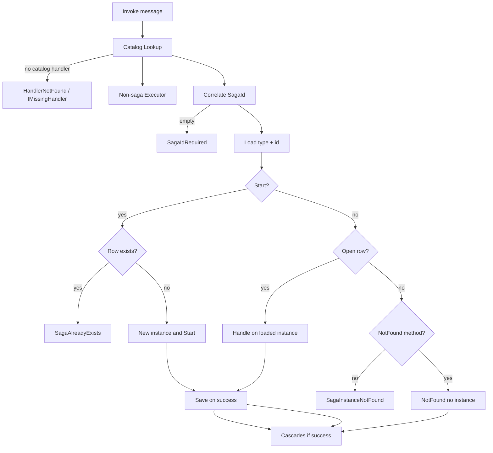
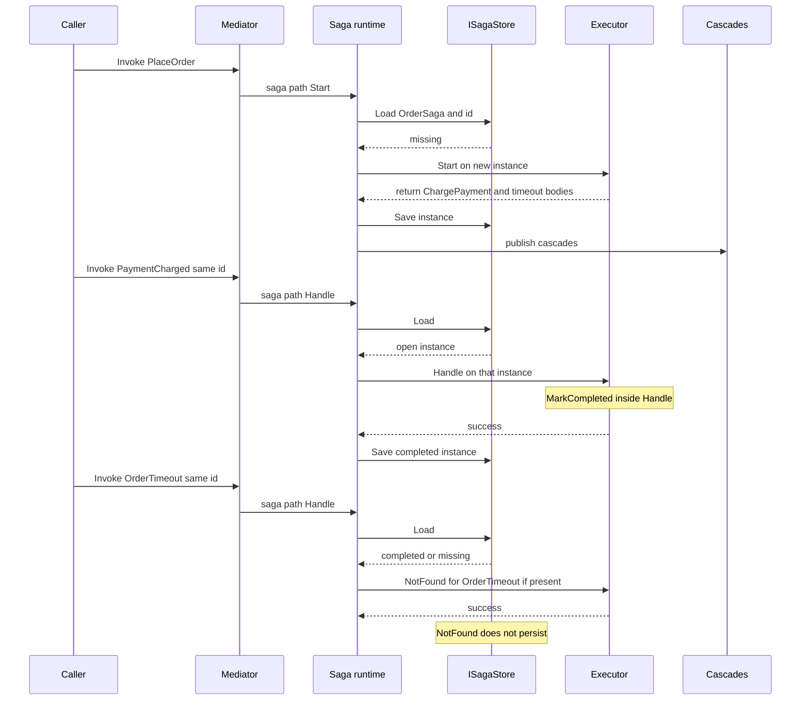

# Spec: Application/Sagas (conversation kernel)

Draft from `/brainstorm-spec` 2026-09-04. Eng-cleared 2026-09-04. Personality: **inspectable kernel** — catalogs you can read, named failures, no catch-all. This slice is the process-manager **runtime**, not durable storage and not the clock.

Does not amend the 12-month kernel except filling the Application/Sagas slot for this iteration. `SagaConcurrencyConflict`, one storage session per handling, Helpdesk `TrackActivity`, and Scheduling remain later slices. Where this document is silent, the kernel still governs.

**Type budget (eng):** no `SagaRuntime`, no `NotFoundCatalog`. Mediator owns the saga path. Executor gains per-attempt `resolveTarget`. `ISagaStore` + one in-memory store. Domain `CanCorrelate`. `HandlerCatalog.Scan` throws `InvalidHandlerSignature` for saga rules.

---

## 1. Outcomes & Why

Domain already knows which saga instance a message belongs to (`SagaIdentityNaming`, `SagaId`, `[SagaIdentity]`) and whether an instance is finished (`MarkCompleted` / `IsCompleted`). Discovery already treats `Start` as a handler. Cascades already skip returning a `Saga` instance. None of that **runs a conversation**: `Invoke` always stamps an empty `SagaId`, `Executor` always `new`s the handler type, and a second message cannot see the instance `Start` created.

**Why now:** the README prove-with for this folder is “PaymentCharged loads the same instance Start created; after complete, timeout hits NotFound instead of failing.” That is a dispatch-and-store problem, not a Persistence or Scheduling problem. Scheduling can still deliver `OrderTimeout` later as an ordinary message. Persistence can later replace the in-memory store with a durable row in the same session as inbox/outbox.

**Success:** a `MiniVerine.Tests` fixture saga, `Invoke` only — Start, then Handle on the same id (state survived), then `MarkCompleted`, then a later message hits `NotFound` instead of a fault. An engineer can follow one id through open → completed → miss without generated code, Marten, or a timer.

## 2. Scope

**In:**

- Process-manager runtime on today’s `Invoke` path: load by id, run `Start` / `Handle`, run `NotFound` only on miss
- `ISagaStore` as an Application port plus an in-memory implementation sufficient for tests
- Correlation: saga handlers require a resolvable non-empty `SagaId`
- Duplicate `Start` when that id already exists (open or completed) → named `SagaAlreadyExists`
- Unified miss for later Handle-bound messages: completed and never-started are the same at the method boundary
- Success-only persist of the instance that ran; throw discards this invoke’s mutations
- Discovery rules: correlatable shape; `Start`+`Handle` (or `*Async` / `Consume`) for the same message on the same saga type is invalid; `NotFound` is not a catalog handler
- Envelope carries the correlated `SagaId` on the saga path
- README: Application/Sagas moves from Plan-only to done-as-conversation-kernel; `SagasPlan` is removed when types exist
- Prove-with tests in `MiniVerine.Tests` with a fixture saga (not Helpdesk, not Tracking, not a scheduler)

**Out (this iteration):**

- Durable Persistence slice (inbox, outbox, one session, claim/lease, EF, Npgsql)
- Optimistic concurrency / `SagaConcurrencyConflict` reload-retry-poison
- Scheduling / `[Timeout]` → `DeliverBy` / fast-forward / `PlayScheduledMessagesAsync`
- Helpdesk `OrderSaga` sample and Helpdesk.Tests conversation
- Tracking `TrackActivity`
- Deleting completed rows (GC)
- Poison / `PublishAsync` workers (Invoke only, same as Middleware)
- Version property on saga as a required kernel field
- Marten / JasperFx
- Catch-all `Exception`

**Deferred (named follow-up):**

- Persistence owns durable saga rows in the same session as inbox/outbox; in-memory adapter must stay atomic when that slice lands
- `SagaConcurrencyConflict` per kernel (reload, retry per Execution policy, then poison)
- Scheduling delivers timeout messages; Tracking plays them now
- Helpdesk teaching conversation (`PlaceOrder` / `ChargePayment` / `OrderTimeout` `NotFound`)
- Constructor DI for new saga instances when Hosting owns resolution (this slice keeps today’s parameterless construction for **new** Start instances)
- Completed-row GC / operator inspect of completed instances beyond “row still exists so duplicate Start faults”
- `Publish` / local-queue workers using this same runtime

## 3. Constraints

- Onion: Domain/Sagas stays identity and inert state (no I/O). Application/Sagas owns conversation + port. Adapters/Persistence own durable rows later. This folder must not know Marten, EF, or SQL.
- Existing Domain types are not throwaways: `Saga`, `SagaId`, `[SagaIdentity]`, `SagaIdentityNaming`. Empty `SagaId` remains valid on Envelope for **non-saga** messages.
- Kernel handler model: `Handle` / `HandleAsync` / `Consume` / `Start` (+ `*Async`) stay catalog conventions. Method-parameter DI stays forbidden. Constructor DI for **new** instances is Hosting-later; loaded Handle instances come from the store.
- Cascades unchanged: `Saga` in a return value is not published; throw publishes nothing.
- Middleware pipe unchanged: saga `Start`/`Handle`/`NotFound` that run as handler invokes still go through Executor’s doll. `HandleMissingAsync` stays unwrapped. `NotFound` is **not** the missing-handler path.
- No source generators. Packages 0.x.
- Completeness bias: a small complete conversation (in-memory port + dispatch rules) beats a half-wired Helpdesk demo.
- In-memory store in this slice is a test/runtime fake, not Production durability. Production refuse-in-memory stays a Persistence/Hosting rule.
- Scheduling is **not** a prerequisite: a timeout message is `Invoke`d like any other Handle-bound saga message.

## 4. Decisions

| Decision | Choice | Rejected / why |
|----------|--------|----------------|
| Slice ambition | Conversation kernel: in-memory port + dispatch + fixture prove-with | Teaching conversation (pulls Scheduling/Tracking/Helpdesk); kernel+concurrency; Persistence-first pause; discovery-only (cannot prove same instance) |
| Later Handle after complete | Unified miss: `NotFound` or `SagaInstanceNotFound`. Store may keep the row. `NotFound` does not receive the instance. | Load completed instance into `NotFound`; delete-on-complete this slice |
| Duplicate Start | Named `SagaAlreadyExists` if the store already has that saga type + id (open or completed). Do not run Start. | Idempotent no-op; completed → miss; missing Start then Handle |
| Empty / uncorrelatable id | Correlatable required. Uncorrelatable shape → `InvalidHandlerSignature` at discovery. Present-but-empty at runtime → `SagaIdRequired`. | Silent skip (“not this saga”); runtime-only fault; Start-required / Handle-as-miss |
| `NotFound` in the model | Miss-path only. Never a normal catalog handler. Open → Handle/Start. Miss → `NotFound` if present else `SagaInstanceNotFound`. | Catalogued kind; treat as Handle (fan-out trap) |
| Start + Handle same message, same saga type | Invalid discovery (`InvalidHandlerSignature`), including `*Async` and `Consume` as Handle-equivalent | Start wins; allow dead Handle; both run on first message |
| Persist | Success commits the instance that ran (open or `IsCompleted`). Throw: no new Start row; Handle leaves previous row unchanged; no cascades. `NotFound` does not persist an instance. | Insert-before-Start; persist only if saga returned |
| Prove-with | `MiniVerine.Tests` fixture saga, `Invoke` only | Helpdesk types this slice; Tracking/scheduler; runtime-without-conversation |
| Store key | Saga CLR type + `SagaId` | Global id without type; `OrderSaga.Id` as the only key |
| New vs loaded instance | Missing + Start: construct new, invoke, save on success. Open + Handle: load stored instance, invoke **that** object, save on success. Do not `new` an open saga. | Always `Activator.CreateInstance` (today’s Executor; would lose state) |
| Completed vs missing (Start) | Row exists (including completed) → `SagaAlreadyExists`. No row → Start. | Treat completed as missing for Start (would restart the conversation) |
| Completed vs missing (Handle) | Unified miss (no Handle) | Distinct load-into-NotFound |
| Static saga methods | Invalid discovery — persist needs an instance | Allow static Start with no row |
| `Consume` on a saga | Handle-equivalent (load/save). Start+Consume same message invalid. Handle+Consume same message on the same saga type invalid. | Leave Consume as a second catalog handler on the same instance |
| Envelope | On the saga path, Envelope carries the correlated `SagaId` | Leave Mediator’s empty `SagaId` on saga invokes |
| `NotFound` faults/cascades | Same success/throw/cascade rules as Handle, via Executor, not `HandleMissingAsync` | Ack-only (ignore returns); missing-handler path |
| Fan-out across types | A saga handler and a non-saga handler for the same message may both run (today’s Invoke foreach). Each saga type is its own conversation. | Forbid non-saga + saga for one message this slice |
| Fan-out Envelope | One Envelope **copy per discovered handler**. Saga path stamps `SagaId` on that copy only. | Stamp the shared Invoke Envelope (leaks id into non-saga); forbid mixed fan-out |
| Type budget | No `SagaRuntime` / `NotFoundCatalog`. Mediator owns saga path. `NotFound` is a synthetic `DiscoveredHandler` for Executor only. | Separate dispatcher + NotFound catalog |
| Executor instance | `InvokeAsync` takes per-attempt `resolveTarget` (`Func<object?>`). Default remains `Activator.CreateInstance` so existing tests stay green. Each Retry calls resolve again. | Skip inner retry on sagas; Mediator second retry loop |
| Snapshot | In-memory store **shallow-clones on Save and Load** (`MemberwiseClone`). Load returns a working copy of the last successful snapshot. No `Clone()` on Domain `Saga`. | Mediator clones; no clone this slice |
| Correlatable at scan | Domain `SagaIdentityNaming.CanCorrelate(Type messageType, Type sagaType)` — same property walk as `For`. No dummy message instance. | Duplicate walk in Application; uninitialized object + `For` |
| Invalid signature | `HandlerCatalog.Scan` **throws** `InvalidHandlerSignature` (uncorrelatable, Start+Handle/Consume, Handle+Consume, static saga). Alias collisions stay validator-only. Invoke does not call `Validate()` today. | Validator-only (Invoke would still dispatch); wire Validate on every Invoke this slice |
| Store port | `Load(Type, SagaId) → Saga?` and `Save(Type, SagaId, Saga)` only | `Exists`; Delete/list/version |
| Named errors home | `InvalidHandlerSignature` in Discovery (with `HandlerNotFound`). `SagaAlreadyExists` / `SagaInstanceNotFound` / `SagaIdRequired` in Application/Sagas. Thrown from **Mediator before Executor** so they are not wrapped as `HandlerFault`. | Nested under `HandlerFault`; Executor passthrough list |
| Stamp `Id` on instance | No — store key is type+`SagaId`; author-owned `Id` is optional | Runtime copies correlated id onto `Id` |
| `Start`+`NotFound` same message | Allowed (dead miss path; `Start` occupies missing) | Invalid discovery |
| In-memory adapter | `Application/Sagas` next to `ISagaStore`. Tests inject it. Durable session waits for Persistence. | Test-only Dictionary; Persistence folder this slice |
| `StartAsyncMessage` fixture | Give it a correlatable id so `Scan(StartAsyncSaga)` stays valid | Leave uncorrelatable; delete fixture |
| Concurrency | Out of slice | Implement `SagaConcurrencyConflict` now |
| Clock | Out of slice | Require Scheduling to land first |

## 5. Behavior & Flows

**Public personality:** You write a saga class (`Saga` subclass) with `Start`/`Handle` and optional `NotFound`. You `Invoke` messages. The runtime correlates the message to an id, loads or creates that instance, and either continues the conversation, completes it, or treats a late message as harmless (`NotFound`) or named (`SagaInstanceNotFound`). Identity stays on the message; the store key is type + id.

**What is a saga handler:** a discovered catalog method (`Start` / `Handle` / `Consume` and `*Async`) whose declaring type extends `Saga`. `NotFound` / `NotFoundAsync` live on that type and are **not** in `HandlerCatalog.Lookup`.

**Correlation:** `SagaIdentityNaming.For(message, sagaType)` must be able to resolve a non-empty id for every saga catalog method. If the message shape cannot correlate to that saga type, discovery fails (`InvalidHandlerSignature`) — this is how `ChargePayment`-style properties stay non-saga: they must not be declared as saga handlers. If the shape correlates but the value is empty at runtime, `SagaIdRequired`.

```text
Invoke(message)
  → lookup catalog handlers (miss → HandleMissingAsync / HandlerNotFound — unchanged, not saga NotFound)
  → for each DiscoveredHandler (abort foreach on first throw, as today):
       if handler type is not a Saga:
         Executor as today
       else:
         saga path (below)
       → cascades from return value only if Executor returned
```

```text
SAGA PATH (one discovered saga handler)
  id = SagaIdentityNaming.For(message, sagaType)
  empty id → SagaIdRequired (named; no persist; no cascades)
  Envelope.SagaId = id

  row = store.Load(sagaType, id)

  if method is Start:
    row exists → SagaAlreadyExists
    row missing → new instance → Executor(Start) → success: save instance
  else:  # Handle / Consume
    row missing OR row.IsCompleted → miss path
    row open → Executor(Handle on loaded instance) → success: save instance
```

```text
MISS PATH (Handle-bound, completed or never-started)
  if saga type has NotFound(messageType) or NotFoundAsync:
    Executor(NotFound) — no saga instance argument, no persist
    success → cascades from return; failure → named fault as Handle
  else:
    SagaInstanceNotFound
```





**Store**

- Port: load and save an instance by saga CLR type and `SagaId`. In-memory is enough.
- Success replace: the stored snapshot changes only after the method returns successfully. A throwing Handle must not leave in-place mutations on the stored instance (do not share a mutable object that is “already stored”).
- Completed rows remain so a later Start still sees `SagaAlreadyExists`.
- `NotFound` never writes.

**Retries:** Execution may retry a throwing Start/Handle. Each attempt calls `resolveTarget` again. Because persist is success-only and Load returns a clone, a retry of Start still sees missing; a retry of Handle loads the **previous** snapshot again, not the mutated thrown instance.

**Named errors vs Executor:** `SagaAlreadyExists`, `SagaIdRequired`, and `SagaInstanceNotFound` are thrown by Mediator **before** `Executor.InvokeAsync`. They must not become `HandlerFault`. User throws inside `Start`/`Handle`/`NotFound` still become `HandlerFault` as today.

**`NotFound` convention:** public instance `NotFound` / `NotFoundAsync` on the saga type; first parameter is the message. It is selected by the runtime on miss, not by `HandlerCatalog.Lookup`. Authors may declare both `Handle(OrderTimeout)` and `NotFound(OrderTimeout)`.

**Discovery invalid (named `InvalidHandlerSignature`, not a silent omit):**

- Saga catalog method whose message cannot correlate to that saga type
- Same saga type: `Start` and `Handle`/`Consume` (any `*Async` variant) for the same message type
- Same saga type: `Handle` and `Consume` for the same message type
- Static saga `Start`/`Handle`/`Consume`

**Not invalid:** `Handle` + `NotFound` for the same message. `Start` + `NotFound` for the same message is dead (`Start` occupies missing); allowed, not a scan failure.

**Id vs `Saga.Id`:** Domain still has no `Id` on `Saga`. The runtime keys the store by correlated `SagaId`. Authors may set their own `Id` property; the runtime does not require it.

## 6. Acceptance Criteria

- WHEN a fixture saga `Start` is Invoked with a correlatable id and the store has no row, THE SYSTEM SHALL construct a new instance, run `Start`, and persist that instance only after `Start` returns.
- WHEN a later Handle-bound message with the same saga type and id is Invoked, THE SYSTEM SHALL run `Handle` on the persisted instance, not a new object, and THE SYSTEM SHALL observe state `Start` wrote.
- WHEN `Handle` calls `MarkCompleted` and returns, THE SYSTEM SHALL persist the instance as completed and SHALL publish exactly that method’s cascading return values.
- WHEN a later Handle-bound message arrives after complete, THE SYSTEM SHALL NOT run `Handle`. WHEN `NotFound` exists for that message type, THE SYSTEM SHALL run it without passing the saga instance and SHALL NOT persist. WHEN `NotFound` does not exist, THE SYSTEM SHALL throw `SagaInstanceNotFound`.
- WHEN a Handle-bound message arrives for an id that was never started, THE SYSTEM SHALL use the same miss path as completed (unified miss).
- WHEN `Start` is Invoked and a row already exists for that type and id (open or completed), THE SYSTEM SHALL throw `SagaAlreadyExists`, SHALL NOT run `Start`, SHALL NOT persist, and SHALL publish no cascades.
- WHEN a saga catalog method’s message shape cannot resolve a non-empty `SagaId` for that saga type, THE SYSTEM SHALL fail discovery with `InvalidHandlerSignature` (not silently skip).
- WHEN a saga handler is Invoked and the correlated id value is empty, THE SYSTEM SHALL throw `SagaIdRequired` and SHALL NOT persist or publish cascades.
- WHEN the same saga type declares `Start` and `Handle` (or `Consume`, or `*Async` variants) for the same message type, THE SYSTEM SHALL fail discovery with `InvalidHandlerSignature`.
- WHEN `Lookup` is performed for a message that has `Handle` and `NotFound` on a saga, THE SYSTEM SHALL return the `Handle` method only (`NotFound` is not a catalog handler).
- WHEN `Start` or `Handle` throws, THE SYSTEM SHALL persist nothing from that invoke (no new Start row; previous Handle row unchanged) and SHALL publish no cascades.
- WHEN `NotFound` throws, THE SYSTEM SHALL publish no cascades and SHALL surface the fault through Executor as for `Handle` (not `HandlerNotFound`).
- WHEN a saga handler runs, THE SYSTEM SHALL set `Envelope.SagaId` to the correlated id.
- WHEN a non-saga handler runs, THE SYSTEM SHALL NOT require a `SagaId` and SHALL leave today’s empty-id Envelope behavior unchanged.
- WHEN no catalog handler exists, THE SYSTEM SHALL use `HandlerNotFound` / `IMissingHandler`, not `SagaInstanceNotFound`.
- WHEN `InvokeAsync` is cancelled during a saga handler, THE SYSTEM SHALL throw `OperationCanceledException`, SHALL NOT persist that invoke, and SHALL NOT convert cancel into `SagaAlreadyExists` / `SagaInstanceNotFound`.
- MiniVerine SHALL NOT require Scheduling, Tracking, Helpdesk types, EF, or Marten to pass this slice’s tests.
- MiniVerine SHALL NOT implement `SagaConcurrencyConflict` in this slice.

## 7. Risks & Mitigations

| Risk | Mitigation |
|------|------------|
| In-memory store becomes a second Persistence | Port only; durable session/concurrency explicitly Out; Persistence replaces the adapter |
| Mutable in-place instance + throw leaks state | Success-replace snapshots; prove-with: throw Handle then Invoke again sees pre-throw state |
| README slice order (Scheduling before Sagas) vs this work | Timeouts are ordinary Invoke; Scheduling still owns `DeliverBy` / play-now |
| Duplicate PlaceOrder under at-least-once delivery | Named `SagaAlreadyExists` this slice; inbox de-dupe is Persistence |
| Authors put `Handle(ChargePayment)` on the saga | Uncorrelatable shape fails discovery instead of silent skip |
| `NotFound` accidentally fan-out with `Handle` | `NotFound` not in catalog; Lookup test |
| Executor `CreateInstance` on Handle wipes state | Saga path must load; prove-with same-instance |
| Completed row grows forever | Deferred GC; this slice needs the row for `SagaAlreadyExists` |
| Helpdesk teaching gap until sample slice | Fixture saga documents the conversation; Helpdesk deferred by name |

## 8. Rollout & Observability

- No feature flag; 0.x additive types and named errors
- Logs: follow kernel — message type, envelope/conversation/correlation/**saga** ids, named error. No payload.
- Remove `SagasPlan` when the runtime exists
- Hosting does not need to auto-register a store this slice; tests inject the in-memory port
- Later Persistence registers the durable adapter against the same port; later Scheduling Invokes/Publishes timeout messages into this runtime unchanged

## 9. Open Questions

None — eng review locked the former table (stamp `Id` = no; Scan throws; `Start`+`NotFound` allowed; in-memory next to `ISagaStore`; exception folders as in §4).

## Implementation Tasks

- [ ] **T1 (P1)** — Domain `CanCorrelate` — extract the identity-property walk shared by `For` and `CanCorrelate(Type, Type)`
  - Surfaced by: architecture — discovery cannot `new` a positional `PlaceOrder` record
  - Files: `src/MiniVerine/Domain/Sagas/SagaIdentityNaming.cs`, `tests/MiniVerine.Tests/Domain/Sagas/SagaIdentityNamingTests.cs`
  - Verify: ChargePayment-style shape is not correlatable; `[SagaIdentity]` / `{SagaType}Id` / `Id` still match `For`

- [ ] **T2 (P1)** — Discovery — `InvalidHandlerSignature`; `Scan` throws for saga rules; `StartAsyncMessage` gets a correlatable id
  - Surfaced by: architecture — Invoke never `Validate()`s; tests — existing `StartAsyncSaga` fixture
  - Files: `src/MiniVerine/Application/Discovery/HandlerCatalog.cs`, `InvalidHandlerSignature.cs`, `tests/MiniVerine.Tests/Application/Discovery/`
  - Verify: uncorrelatable saga Scan throws; Start+Handle same message throws; `HandlerConvention.For(StartAsync)` still green; `Scan(StartAsyncSaga)` succeeds after fixture id

- [ ] **T3 (P1)** — Executor per-attempt `resolveTarget` — default `CreateInstance`; each Retry calls the factory
  - Surfaced by: architecture — `InvokeOnce` always `Activator.CreateInstance` (`Executor.cs:150`)
  - Files: `src/MiniVerine/Application/Execution/Executor.cs`, `tests/MiniVerine.Tests/Application/Execution/ExecutorTests.cs`
  - Verify: existing Executor/Mediator tests green with no factory; new test: factory invoked once per attempt

- [ ] **T4 (P1)** — `ISagaStore` + in-memory clone on Save/Load (`Load`/`Save` only)
  - Surfaced by: architecture — dirty snapshot; code quality — port surface
  - Files: `src/MiniVerine/Application/Sagas/ISagaStore.cs`, `InMemorySagaStore.cs` (names may match folder root), tests under `tests/MiniVerine.Tests/Application/Sagas/`
  - Verify: Save then Load is not the same reference; mutate loaded instance, Load again sees pre-mutate snapshot

- [ ] **T5 (P1)** — Mediator saga path — correlate, per-handler Envelope, named errors before Executor, synthetic `NotFound` `DiscoveredHandler`, save on success
  - Surfaced by: architecture — fan-out Envelope bleed; named errors vs `HandlerFault`
  - Files: `src/MiniVerine/Application/Mediator/Mediator.cs`, `SagaAlreadyExists.cs`, `SagaInstanceNotFound.cs`, `SagaIdRequired.cs`; optional tiny NotFound method helper in Application/Sagas (not a catalog)
  - Verify: conversation prove-with; duplicate Start; miss with/without NotFound; non-saga Invoke still empty `SagaId`; mixed fan-out does not stamp the non-saga copy

- [ ] **T6 (P1)** — Tests — see coverage diagram in eng review
  - Surfaced by: test review
  - Files: `tests/MiniVerine.Tests/Application/Sagas/`, plus T1–T5 test files
  - Verify: `dotnet test tests/MiniVerine.Tests`

- [ ] **T7 (P2)** — Docs — Application/Sagas done-as-conversation-kernel; remove `SagasPlan`
  - Surfaced by: spec rollout
  - Files: `README.md`, delete `src/MiniVerine/Application/Sagas/SagasPlan.cs`
  - Verify: README does not teach Plan-only Application/Sagas; Helpdesk sample still later

## STRYDER REVIEW REPORT

| Review | Status | Findings |
|--------|--------|----------|
| Eng    | Cleared with locks applied to this spec | Type budget: no SagaRuntime. Arch: per-attempt resolveTarget; store clone; Domain CanCorrelate; Scan throws; per-handler Envelope. Code: Load/Save only. Tests: StartAsyncMessage identity; coverage diagram in review. Perf: no issue this slice. |

**VERDICT:** ENG CLEARED — ready to implement

**UNRESOLVED DECISIONS:** NO UNRESOLVED DECISIONS
