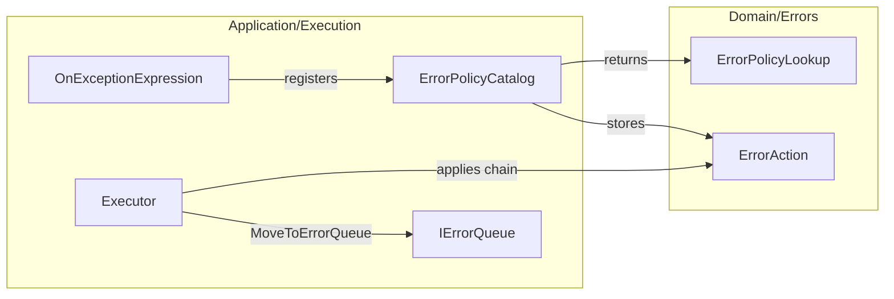

# Spec: Layer taxonomy cleanup (Application ValueObjects)

Draft for sign-off. Personality: restore the onion split the kernel already uses in Domain — named vocabulary is Domain; Application orchestrates and does not own `ValueObjects/` folders.

---

## 1. Outcomes & Why

Application started copying Domain’s `ValueObjects/` convention (Discovery lookups, then Execution error actions). That made Application look like a second domain model. The kernel rule is: **Domain owns value objects; Application owns ports, catalogs, and orchestration records.**

**Why now:** Execution just added `ErrorAction` / `ErrorPolicyLookup` under `Application/Execution/ValueObjects/` while Discovery still has `Application/Discovery/ValueObjects/`. Later slices will copy whichever pattern is on disk.

**Success:** an engineer or agent opening `src/MiniVerine` can see `ValueObjects/` only under Domain, can find named recovery in `Domain/Errors`, and can add an Application slice without creating a `ValueObjects/` folder.

## 2. Scope

**In:**

- All of `src/MiniVerine` (Domain, Application, Infrastructure/Hosting) inspected for taxonomy and layer placement
- New Domain feature **Errors**: `ErrorAction` hierarchy and `ErrorPolicyLookup` / `FoundErrorPolicy` / `MissingErrorPolicy`
- FluentValidation for those Domain Errors value objects, with tests
- Delete every `Application/**/ValueObjects/` folder; flatten remaining Application records into their feature folders and drop `.ValueObjects` from their namespaces
- Update usings in core and `tests/MiniVerine.Tests` so the solution builds
- README layout / “what is done” so the next slice does not reintroduce Application `ValueObjects/`

**Out (this iteration):**

- Adapter projects (`MiniVerine.Postgresql`, `.RabbitMQ`, `.Http`)
- Helpdesk sample
- Mirroring Application taxonomy into `tests/` folder layout (test *namespaces/usings* still follow the move)
- New Application folders such as `Exceptions/` or `Ports/`
- `ErrorPolicyCatalogValidator` or calling Errors validators from `ErrorPolicyCatalog.Register`
- Moving `ErrorPolicyCatalog`, `OnExceptionExpression`, `Executor`, `IErrorQueue`, `HandlerFault`, `HandlerNotFound`, `OutgoingMessages`, or Discovery records into Domain
- Execution policy behavior (when to retry, error-queue, requeue)
- Rewriting the 12-month kernel spec
- Infrastructure `ValueObjects/` folders (Hosting options stay as hosting types)

**Deferred (named follow-up):**

- `ErrorPolicyCatalogValidator` composing Domain Errors validators (same pattern as `HandlerCatalogValidator`)
- Whether `ErrorPolicyCatalog` itself should live in Domain (like `MessageTypeCatalog`) after Execution has settled
- Application test-folder mirroring

## 3. Constraints

- Onion: Domain has no I/O; Application has ports only; adapters stay separate projects
- Domain `ValueObjects/` remains the only `ValueObjects/` tree in `src/MiniVerine`
- Namespaces follow folders (0.x: breaking namespace moves are expected)
- No new public behavior except validator *results* when those validators are run
- `ErrorPolicyCatalog.Register` / `OnExceptionExpression` keep today’s `ArgumentNullException` guards; they do **not** start running FluentValidation this iteration
- Negative `RetryWithCooldown` delay can still be *registered* until the deferred catalog validator; the Domain validator rejects it when validated
- Do not reshuffle Envelope / Messaging / Sagas types that already match the taxonomy
- Infrastructure/Hosting: inspect only; `MiniVerineOptions` is not a value object

## 4. Decisions

| Decision | Choice | Rejected / why |
|----------|--------|----------------|
| Kind of cleanup | Taxonomy + layer placement | Folder-only (misses onion); full-repo aesthetic audit of Helpdesk/adapters |
| Sweep | `src/MiniVerine` | Whole repo including Helpdesk/adapters; tests folder-mirroring |
| Application ValueObjects | Application does not own `ValueObjects/` | Matching Domain folders inside Application; moving all Application records into Domain |
| Split | Domain-shaped vocabulary → Domain; handler/discovery/orchestration records stay in Application as feature-root types | Moving `DiscoveredHandler` / `MissingHandler` into Domain (Domain would learn reflection/handlers) |
| Domain-bound set | `ErrorAction` + all named actions + `ErrorPolicyLookup` / `FoundErrorPolicy` / `MissingErrorPolicy` | Also `HandlerFault` / `HandlerNotFound`; also `OutgoingMessages` |
| Domain home | New `Domain/Errors` | Under Envelope (policy is not envelope fields); `Domain/Execution` (second Execution folder); under Messaging (not wire names) |
| Catalog stays | `ErrorPolicyCatalog`, expressions, Executor, `IErrorQueue`, `HandlerFault` stay in Application/Execution | Moving the catalog into Domain this iteration |
| Change budget | Relocate + Domain Errors validators | Relocate-only; drive-by tightening of `OutgoingMessages` / exceptions; changing retry/error-queue behavior |
| Validator rules | Delay ≥ 0; found chain non-null and non-empty; missing exception type non-null; marker actions have no extra rules | Not-null only; catalog validator in the same pass |
| Slice | This locked slice | Flatten-only (leaves error vocabulary in Application); wait until more slices exist |
| Domain XML comments | Name the action only; drop InvokeAsync / caller-thread / port wording | Keep teaching comments on Domain types |
| Domain/Errors files | One record per file (Envelope style) | Hierarchy in one file |
| README | Layout + Domain/Errors done-section + fix mermaid “Application not built yet” note | Layout-only; rewrite the whole sequence |
| Executor tests this slice | Validator tests + Register-accepts-negative-Delay + InvokeAsync with `RetryWithCooldown(TimeSpan.Zero)` | Validator-only; positive-delay timing test |

## 5. Behavior & Flows

**Taxonomy after cleanup**

```text
Domain/
  Envelope/     ValueObjects/ + Validators/   (unchanged)
  Messaging/    ValueObjects/ + Validators/   (unchanged)
  Sagas/        ValueObjects/ + Validators/   (unchanged)
  Errors/       ValueObjects/ + Validators/   (new)
Application/
  Discovery/    records at feature root (DiscoveredHandler, HandlerLookup, …)
                HandlerCatalog, HandlerConvention, IMissingHandler, HandlerNotFound
                Validators/HandlerCatalogValidator
  Execution/    ErrorPolicyCatalog, OnExceptionExpression, Executor,
                IErrorQueue, HandlerFault   — no ValueObjects/
  Cascades/     OutgoingMessages, CascadingMessages, ICascadePublisher
  Routing/      RoutingCatalog, PublishExpression, LocalQueueAttribute
  Bus/          IMessageBus
  Mediator/     Mediator
Infrastructure/Hosting/   MiniVerineOptions, host builder — unchanged
```

**Layer split (named recovery)**



Discovery records (`DiscoveredHandler`, `FoundHandlers`, `HandlerLookup`, `MissingHandler`) stay Application types. They are catalog results, not Domain value objects. Named exceptions (`HandlerNotFound`, `HandlerFault`) stay at the feature-folder root.

**On-disk:** one record per file under `Domain/Errors/ValueObjects` (`ErrorAction.cs`, `Retry.cs`, `RetryWithCooldown.cs`, `MoveToErrorQueue.cs`, `Requeue.cs`, `ScheduleRetry.cs`, `Discard.cs`, `ErrorPolicyLookup.cs`, `FoundErrorPolicy.cs`, `MissingErrorPolicy.cs`). Validators only for types with rules (`RetryWithCooldown`, `FoundErrorPolicy`, `MissingErrorPolicy`).

**Comments:** Domain XML comments name the action. They do not mention `InvokeAsync`, caller thread, or ports.

**Validator composition:** Domain Errors validators are first-class types with tests, like `AttemptsValidator`. Nothing in Application is required to `SetValidator` them this iteration.

## 6. Acceptance Criteria

- WHEN listing directories under `src/MiniVerine/Application`, THE SYSTEM SHALL have no `ValueObjects` folder.
- WHEN listing directories under `src/MiniVerine/Domain`, THE SYSTEM SHALL have `Errors/ValueObjects` and `Errors/Validators`.
- WHEN Application Discovery types are referenced, THE SYSTEM SHALL expose them in `MiniVerine.Application.Discovery` (not `.ValueObjects`).
- WHEN error actions and policy lookups are referenced, THE SYSTEM SHALL expose them in `MiniVerine.Domain.Errors.ValueObjects`.
- WHEN `RetryWithCooldownValidator` (or the Errors validator that covers that type) validates `Delay < TimeSpan.Zero`, THE SYSTEM SHALL produce a validation error.
- WHEN that validator validates `Delay >= TimeSpan.Zero`, THE SYSTEM SHALL produce no validation error for Delay.
- WHEN `FoundErrorPolicy` is validated with a null or empty `Actions` list, THE SYSTEM SHALL produce a validation error.
- WHEN `FoundErrorPolicy` is validated with one or more actions, THE SYSTEM SHALL produce no validation error for Actions emptiness.
- WHEN `MissingErrorPolicy` is validated with a null `ExceptionType`, THE SYSTEM SHALL produce a validation error.
- WHEN marker actions (`Retry`, `MoveToErrorQueue`, `Requeue`, `ScheduleRetry`, `Discard`) are validated, THE SYSTEM SHALL not introduce extra field rules.
- WHEN `ErrorPolicyCatalog.Register` / `OnExceptionExpression.RetryWithCooldown` run as today, THE SYSTEM SHALL still reject nulls via `ArgumentNullException` and SHALL NOT newly throw on negative Delay.
- WHEN `ErrorPolicyCatalog` registers `RetryWithCooldown(TimeSpan.FromTicks(-1))`, THE SYSTEM SHALL not throw (validators are not composed into Register).
- WHEN Executor `InvokeAsync` runs a failing handler whose policy is `RetryWithCooldown(TimeSpan.Zero)` then a success or next action, THE SYSTEM SHALL retry without throwing for the zero delay.
- WHEN existing Execution, Discovery, Mediator, Routing, and Cascades tests run, THE SYSTEM SHALL pass with updated usings only (no policy-behavior change).
- WHEN README layout / what-is-done is read, THE SYSTEM SHALL describe Domain/Errors and SHALL NOT teach Application `ValueObjects/` folders. The teaching mermaid SHALL NOT say Application is unbuilt.
- WHEN Infrastructure/Hosting is inspected, THE SYSTEM SHALL not gain a `ValueObjects/` folder.

## 7. Risks & Mitigations

| Risk | Mitigation |
|------|------------|
| Later Application slices recreate `ValueObjects/` | README + this spec; Application types live at feature root |
| Domain/Errors used as a dumping ground for Execution types | Bound set is the action + lookup family only; catalog/ports stay Application |
| Validators exist but never run on Register | Explicit this iteration; catalog validator is the named follow-up |
| Negative cooldown registered then applied | Current behavior preserved; catalog validator is the follow-up |
| Envelope/Messaging reshuffled “while we’re here” | Inspect-only unless an onion violation is found |

## 8. Rollout & Observability

- Packages are 0.x: namespace moves do not need a compat shim
- No feature flag; one compile-and-test pass
- No runtime metrics change

## 9. Open Questions

| Question | Owner | Default if unresolved |
|----------|-------|------------------------|
| Should `ErrorPolicyCatalog.Register` run Domain Errors validators? | Later Execution/catalog slice | No this iteration |
| Should `ErrorPolicyCatalog` move to Domain/Errors? | After Execution settles | Stay in Application/Execution |
| Amend 12-month kernel spec for Domain/Errors location? | Product | No; README is enough for this cleanup |

## STRYDER REVIEW REPORT

| Review | Status | Findings |
|--------|--------|----------|
| Eng    | Cleared with locks applied to this spec | Step 0 proceed-as-spec; Domain comments; one-file-per-VO; README mermaid note; validator tests + Register negative Delay + Executor zero cooldown |

**VERDICT:** ENG CLEARED — ready to implement

**UNRESOLVED DECISIONS:** NO UNRESOLVED DECISIONS (spec §9 items keep their defaults)
