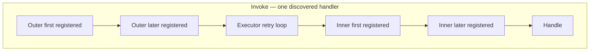

# Spec: Middleware pipe (Russian doll)

Eng-cleared 2026-09-04. Personality: **inspectable kernel** — catalogs you can read, named failures, no catch-all. This slice is the wrapping contract only.

Amends nothing in the 12-month kernel except filling the Middleware slot. Catch-all middleware stays forbidden. Logging, validation, and transactional outbox stay later slices that *use* this pipe.

---

## 1. Outcomes & Why

Execution already wraps one handler call (attempts, retry policy, `HandlerFault`). There is no way to run code around that call without the handler knowing. MiddlewarePlan’s prove-with is: a wrapper runs around `Handle` without `Handle` knowing it exists.

**Why now:** README slice order is Discovery → Bus → Mediator → Cascades → Routing → Execution → **Middleware**. Persistence, Observability, and first-party validation are not built; they need a doll to hang on later. Shipping logging/outbox middleware now would invent collaborators that do not exist.

**Success:** a test registers an instance wrapper; `Handle` stays unchanged; the wrapper’s `next` runs; the catalog says which wrappers applied and in what order. An engineer can follow one envelope through outer → retries of (inner → Handle) → outer without generated code.

## 2. Scope

**In:**

- Two catalogs: **outer** (once per discovered-handler Invoke) and **inner** (once per attempt)
- Registration of wrapper **instances** against a layer plus a target: global, message CLR type, or handler CLR type
- Additive matching: every matching registration runs
- Wrap model: wrapper invokes `next` **exactly once**; try/finally around `next` is allowed
- Named protocol failure when `next` is skipped or called twice
- Invoke path only (today’s `Mediator` + `Executor`)
- README: Middleware moves from Plan-only to done-as-pipe; `MiddlewarePlan` is removed when types exist
- Prove-with tests: wrap without handler knowledge; order; targeting; outer vs inner throw; `next` violation; miss path unwrapped; fan-out isolation

**Out (this iteration):**

- First-party middleware: logging, envelope/message validation, FluentValidation-style handler validation, transactional outbox/session
- Codegen, Roslyn, frames, `AssemblyLoadContext`
- Changing how handlers are written (signatures, method-parameter DI, attributes that *are* the wrapper)
- Continuation power: skip `Handle`, replace the handler result, stop the chain after `Handle`
- Convention engine beyond handler CLR type (assembly, namespace, saga-vs-handler kind, opt-in attributes)
- Wrapping the missing-handler path (`HandleMissingAsync` / `HandlerNotFound`)
- Constructor DI / per-message scoped wrappers (Hosting still Plan-only)
- `PublishAsync` workers (pipe is the same later; this slice does not implement Publish)
- Catch-all `catch (Exception)` that swallows faults or turns them into a generic middleware error
- Admin UI, HTTP, Rabbit, EF, scheduling
- Requeue / ScheduleRetry / Discard behavior in Execution (still unused)

**Deferred (named follow-up):**

- Built-in validation middleware (`EnvelopeValidationFailed`) using Domain validators
- Built-in logging/metrics middleware (Observability; never log envelope body by default)
- Transactional outbox/session as inner middleware (Persistence; one session per attempt)
- Outer-layer first-party use (once-per-Invoke timing, conversation-id assignment if not done in Bus)
- Type registration + DI when Hosting owns scoped-per-message
- Apply the same catalogs on Publish / local-queue workers
- Assembly/namespace/kind/attribute targeting if a real convention appears
- Wrapping or observing missing-handler misses
- Optional per-handler timeout (kernel T7) — Execution, not this pipe

## 3. Constraints

- Onion: Application owns the pipe and catalogs; Domain does not learn middleware; adapters stay out
- Handler programming model unchanged: `Handle` / `HandleAsync` / `Consume` / `Start` still do not mention middleware
- No source generators this year (kernel)
- No catch-all middleware and no catch-all in the pipe (kernel)
- Wrappers must not mutate `Envelope` (Execution owns `Attempts`; Bus will own conversation ids later)
- Wrappers must not log envelope bodies
- `OperationCanceledException` keeps today’s Execution rule: bubble, no `HandlerFault`, no poison
- `RetryWithCooldown` delay stays **between** inner dolls, not inside them
- Cascades stay **outside** the doll: Mediator publishes return values only after outer `next` returns successfully (none-on-throw unchanged)
- Packages are 0.x: new types need no compat shim
- Completeness bias: a small complete pipe beats a catalog of built-in wrappers

## 4. Decisions

| Decision | Choice | Rejected / why |
|----------|--------|----------------|
| Kind of slice | Pipe + registration only | Plan catalog now (logging/validation/outbox); wait until Persistence needs a wrap |
| Wrapper power | Always call through: `next` exactly once | Short-circuit; replace result; full continuation (second control-flow language) |
| Layers | Outer + inner this slice | Inner-only until a real outer use; one layer “around Execution” (session-across-retries) |
| Outer | Once per discovered-handler `Executor.InvokeAsync` | Once per `IMessageBus.InvokeAsync` (would wrap fan-out as one unit) |
| Inner | Once per attempt, around `Handle` | Around cooldown delay; around cascade publish |
| Layer selection | Explicit on every registration; no default | Default inner or default outer (hides retry/outbox meaning) |
| Same type both layers | Allowed as two registrations | Implicit dual-layer |
| Targeting | Closed set: global, message CLR type, handler CLR type | Convention zoo (assembly/namespace/kind/attribute); global-only; open predicate DSL |
| Matching | Additive: all matches run | Most-specific wins; last registration replaces |
| Order | One catalog, two ordered lists; first registered is outermost **within that layer**; no reshuffle by target kind; no cross-layer reorder | Two catalog classes; specificity bands (global then type then handler) |
| Throws, inner | Execution policy (`Retry` / cooldown / error queue / `HandlerFault`) | Inner throw is always fatal; inner throw is a protocol error |
| Throws, outer | Not retried. `HandlerFault` and `MiddlewareNextViolation` pass through. Any other outer throw is wrapped as `HandlerFault`. | Always wrap (nested `HandlerFault`); bubble unnamed types |
| `next` violation | Named `MiddlewareNextViolation`; Executor rethrows it like `OperationCanceledException` (no `NextAttempt`); not poison | Let it hit error policy; treat as `HandlerFault` |
| Doll home | Executor owns both layers: outer around the retry loop, inner around `InvokeOnce`. Mediator unchanged except default empty catalog. | Outer in Mediator (Publish would miss it); extra `MiddlewarePipeline` type |
| Fan-out throw | Independent dolls; Invoke still aborts remaining handlers on the first throw (today’s foreach) | Continue-on-error (new Invoke contract) |
| Wrapper contract | `IMessageMiddleware`: sees `Envelope`, `DiscoveredHandler`, `CancellationToken`; `next` takes neither Envelope nor a replacement result | `next(Envelope)` substitute; next-only with no Envelope |
| Instance lifetime | Same registered instance is reused (retries and fan-out). Wrappers must be reentrant. Prove with call counts. | `Activator` per attempt; scoped DI this slice |
| Wrap model | Wrapper calls `next` (try/finally allowed) | Bus-invoked Before/After/OnFault hooks only |
| Construction | Register instances | Type + DI this slice; dual instance/type API |
| Missing handler | Not wrapped | Outer-global around miss; inner around miss |
| Fan-out | One doll stack per discovered handler | One outer for the whole Invoke |
| Envelope | Read-only for wrappers | Header mutation as a side channel |
| Publish | Same catalogs later; not built here | A second Publish-specific pipe |

## 5. Behavior & Flows

**Public personality:** You register wrapper instances on a layer with a target. On Invoke, for each discovered handler, Executor builds two dolls from the catalog (read it to see order). Each wrapper must call `next` once. `Handle` does not know the doll exists.

```text
IMessageBus.InvokeAsync(message)
  → lookup handlers (miss → HandleMissingAsync, no middleware)
  → for each DiscoveredHandler (abort foreach on first throw):
       Executor.InvokeAsync
         outer₁ → outer₂ → … → retry loop
           attempt 1: inner₁ → inner₂ → … → Handle
           (cooldown if policy says so — not inside inner)
           attempt 2: inner₁ → inner₂ → … → Handle
           …
         ← outer … ← outer₁
       → cascades from return value only if Executor returned
```

Logical doll is still outer → retries(inner → Handle). Physical home is Executor so later Publish/local queues reuse the pipe. Mediator does not apply wrappers.



```mermaid
sequenceDiagram
  participant M as Mediator
  participant X as Executor
  participant O as Outer wrappers
  participant I as Inner wrappers
  participant H as Handle
  participant C as Cascades

  M->>X: InvokeAsync (this handler)
  X->>O: next once
  Note over O: next is the retry loop
  loop each attempt
    X->>I: next
    I->>H: Handle
    H-->>I: return or throw
    I-->>X: return or throw
    Note over X: MiddlewareNextViolation and cancel rethrow<br/>else error policy; cooldown between attempts
  end
  O-->>X: return or named throw
  X-->>M: return, HandlerFault, MiddlewareNextViolation, or cancel
  alt success
    M->>C: publish return values
  else throw
    Note over C: publish nothing
  end
```

**Registration**

- A registration is: instance + layer (outer | inner) + target (global | message type | handler type).
- Global matches every discovered handler.
- Message type matches `DiscoveredHandler.MessageClrType`.
- Handler type matches `DiscoveredHandler.HandlerType`.
- Non-matching registrations do not run.
- Catalog order is the doll order: first matching registration in that layer catalog is outermost.

**`next` protocol**

- The wrapper’s job is to call `next` exactly once and return its outcome (or throw).
- Calling `next` zero or two+ times → `MiddlewareNextViolation` immediately; inner retry policy does not apply; no cascades.
- Not calling `next` and returning a value is a violation (cannot fake a handler result).
- Observing success vs throw is done with try/finally around `next`, not by skipping.

**Throws**

| Where | What the caller/Execution does |
|-------|--------------------------------|
| Inner wrapper or `Handle` throws `OperationCanceledException` or `MiddlewareNextViolation` | Bubble; no retry policy |
| Inner wrapper or `Handle` throws anything else | Execution policy for that attempt (same as today) |
| Outer wrapper throws `HandlerFault` or `MiddlewareNextViolation` | Pass through; no retry; no cascades |
| Outer wrapper throws anything else | Wrap as `HandlerFault`; no retry; no cascades |
| `next` protocol broken | `MiddlewareNextViolation`; Executor rethrows; no cascades |

**Fan-out:** two handlers for one message → two independent outer+inner stacks. Invoke still aborts remaining handlers when the first throw escapes Executor (today’s foreach). Later inbox isolation is Persistence, not this pipe.

**Static handlers:** still wrapped. Wrappers do not construct the handler; Execution does. Registered wrapper instances are reused and must be reentrant.

## 6. Acceptance Criteria

- WHEN a handler method is invoked through `InvokeAsync` and at least one inner wrapper is registered that matches, THE SYSTEM SHALL invoke that wrapper’s `next` around `Handle` without the handler type referencing middleware.
- WHEN only an outer wrapper matches, THE SYSTEM SHALL invoke it once around the full `Executor.InvokeAsync` for that discovered handler, not once per attempt.
- WHEN only an inner wrapper matches, THE SYSTEM SHALL invoke it once per attempt, not around the cooldown delay.
- WHEN a wrapper is registered global, THE SYSTEM SHALL run it for every discovered handler on Invoke.
- WHEN a wrapper is registered for message type `T`, THE SYSTEM SHALL run it only for handlers whose message CLR type is `T`.
- WHEN a wrapper is registered for handler type `H`, THE SYSTEM SHALL run it only for that handler CLR type.
- WHEN global, message-type, and handler-type registrations all match, THE SYSTEM SHALL run all of them (additive).
- WHEN two wrappers are registered on the same layer, THE SYSTEM SHALL nest them in catalog order (first registered outermost).
- WHEN the same instance is registered outer and inner, THE SYSTEM SHALL run it on both layers as two registrations.
- WHEN Lookup is `MissingHandler`, THE SYSTEM SHALL NOT run outer or inner wrappers.
- WHEN two discovered handlers exist for one message, THE SYSTEM SHALL wrap each handler separately.
- WHEN an inner wrapper or `Handle` throws a fault covered by `Retry` / `RetryWithCooldown`, THE SYSTEM SHALL retry and SHALL run matching inner wrappers again on the next attempt.
- WHEN an outer wrapper throws an unnamed exception, THE SYSTEM SHALL NOT retry the handler and SHALL surface `HandlerFault` whose `InnerException` is that throw.
- WHEN Executor already throws `HandlerFault`, THE SYSTEM SHALL pass it through (no nested `HandlerFault`). Existing Mediator tests that assert `InnerException` is the handler failure SHALL remain valid.
- WHEN a wrapper returns without calling `next` exactly once, THE SYSTEM SHALL throw `MiddlewareNextViolation`, Executor SHALL NOT apply inner error-policy retries, and Mediator SHALL publish no cascades.
- WHEN the same inner instance runs on retries, THE SYSTEM SHALL invoke that same object once per attempt (reentrant; no per-attempt `Activator`).
- WHEN outer `next` throws (including `HandlerFault` after exhausted retries), THE SYSTEM SHALL publish no cascading messages.
- WHEN outer `next` returns successfully, THE SYSTEM SHALL publish exactly the handler return values as today.
- WHEN `InvokeAsync` is cancelled, THE SYSTEM SHALL throw `OperationCanceledException` and SHALL NOT convert that into `HandlerFault` or `MiddlewareNextViolation`.
- WHEN no wrappers are registered, THE SYSTEM SHALL behave as today’s Mediator + Executor (tests already green remain green).
- MiniVerine SHALL NOT ship logging, validation, or outbox middleware in this slice.
- MiniVerine SHALL NOT catch-all `Exception` in the pipe except to classify `OperationCanceledException` as today and to detect `next` protocol violations.

## 7. Risks & Mitigations

| Risk | Mitigation |
|------|------------|
| Two layers unused until Persistence/Observability | Explicit registration; tests prove both layers; outer is not a default |
| Wrapper authors skip `next` | `MiddlewareNextViolation`; cannot substitute a result |
| Inner `try/finally` after `Handle` throws → retry re-runs `Handle` | Documented footgun; later outbox must rollback on throw before rethrow |
| Outer throw after successful `Handle` → side effects, no cascades | Same as today’s “throw after work”; named `HandlerFault`; no retry |
| Catch-all wrapper shipped later | Kernel forbids it; this slice ships no first-party wrappers |
| Targeting engine grows to Wolverine policies | Closed set locked; assembly/kind/attribute are deferred |
| DI/scoping surprises in tests | Instances only; Hosting DI is a follow-up |
| README still lists Cascades as Plan | Out of this spec except Middleware done-section; do not rewrite unrelated stale Plan mentions except if they claim Middleware is unbuilt |

## 8. Rollout & Observability

- No feature flag; 0.x additive types
- No new runtime metrics in this slice (no logging middleware)
- Remove `MiddlewarePlan` when the catalogs exist (same chore as Execution)
- Hosting still does not auto-register wrappers
- Later Observability/Persistence register inner/outer instances (then types) against these catalogs

## 9. Open Questions

| Question | Owner | Default if unresolved |
|----------|-------|------------------------|
| Apply catalogs to `HandleMissingAsync` later? | Later Observability | No until a miss-path wrapper is specified |
| Type registration when Hosting ships scoped-per-message | Hosting slice | Instances remain valid; types are additive |

**Eng-locked (were §9, now decisions):** `MiddlewareNextViolation` lives in `MiniVerine.Application.Middleware`. Wrapper interface name is `IMessageMiddleware` (not ASP.NET `IMiddleware`). Nested `HandlerFault` is forbidden; named faults pass through. Executor owns both layers.

## Implementation Tasks

- [ ] **T1 (P1)** — Catalog — `MiddlewareCatalog` with two ordered lists (outer/inner), explicit layer on register, targets global / message CLR type / handler CLR type, additive exact-type match (same as `HandlerCatalog.Lookup`)
  - Surfaced by: complexity gate — one catalog not two; architecture — targeting
  - Files: `src/MiniVerine/Application/Middleware/MiddlewareCatalog.cs`, `IMessageMiddleware.cs` (Layer enum nested or sibling)
  - Verify: unit tests for match / no-match / order / same instance both layers

- [ ] **T2 (P1)** — `next` protocol — counted `next` owned by the pipe; skip or double-call → `MiddlewareNextViolation`
  - Surfaced by: architecture — protocol vs retry; ASP.NET/MediatR do not enforce this
  - Files: catalog fold/invoke helper next to T1, `MiddlewareNextViolation.cs`
  - Verify: zero `next` and two `next` throw the named type; cannot return a fake handler result

- [ ] **T3 (P1)** — Executor doll — optional catalog default empty; outer around retry loop; inner around `InvokeOnce`; `MiddlewareNextViolation` and `OperationCanceledException` rethrow; unnamed outer throw → `HandlerFault`; existing `HandlerFault` passes through
  - Surfaced by: architecture — doll home, catch (`Executor.cs` ~46–55), passthrough
  - Files: `src/MiniVerine/Application/Execution/Executor.cs`
  - Verify: `dotnet test` — existing Executor/Mediator tests green with no catalog; new tests for inner retry, outer no-retry, cooldown not inside inner (inner call count == attempts)

- [ ] **T4 (P1)** — Mediator — no second wrap site. Default `new Executor(...)` stays empty-catalog. Cascades still after `InvokeAsync` returns
  - Surfaced by: architecture — Executor owns both; fan-out abort unchanged
  - Files: `src/MiniVerine/Application/Mediator/Mediator.cs` only if ctor plumbing is required; otherwise none
  - Verify: existing cascade none-on-throw and `HandlerFault.InnerException` tests

- [ ] **T5 (P1)** — Tests — see coverage diagram in eng review
  - Surfaced by: test review
  - Files: `tests/MiniVerine.Tests/Application/Middleware/`
  - Verify: `dotnet test tests/MiniVerine.Tests`

- [ ] **T6 (P2)** — Docs — Middleware done-as-pipe; remove `MiddlewarePlan`
  - Surfaced by: spec rollout
  - Files: `README.md`, delete `src/MiniVerine/Application/Middleware/MiddlewarePlan.cs`
  - Verify: README does not teach Plan-only Middleware; do not rewrite unrelated stale Cascades Plan mentions

## STRYDER REVIEW REPORT

| Review | Status | Findings |
|--------|--------|----------|
| Eng    | Cleared with locks applied to this spec | Complexity: type budget (1 catalog, 1 interface, 1 exception). Arch: NextViolation escapes retry; named faults pass through; fan-out abort kept; Envelope read-only `next`; Executor owns both layers. Code: reentrant instances. Tests: diagram below. Perf: no cache this slice. |

**VERDICT:** ENG CLEARED — ready to implement

**UNRESOLVED DECISIONS:** NO UNRESOLVED DECISIONS (spec §9 items keep their deferred defaults)
