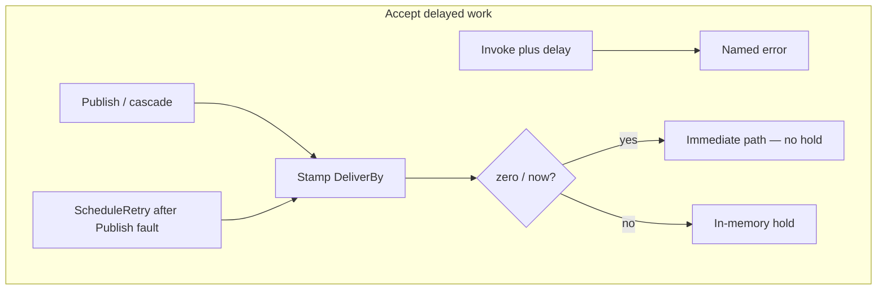
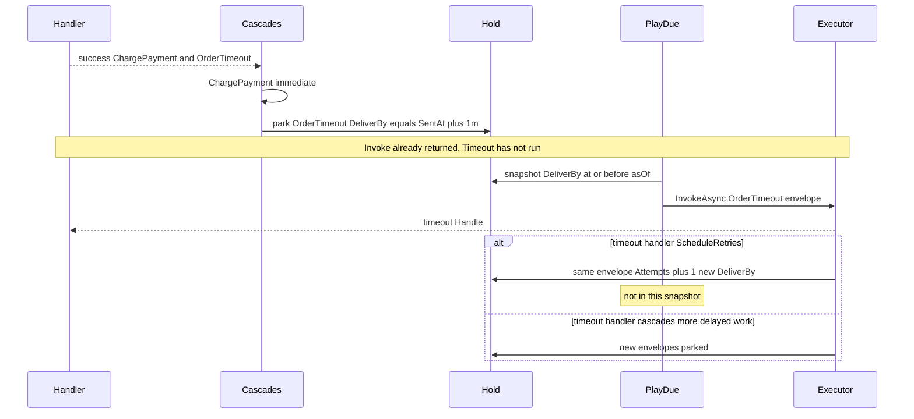

# Spec: Kernel scheduling (time is a message)

Eng-cleared 2026-09-04 (locks applied below). Personality: **inspectable kernel** — catalogs you can read, named failures, no catch-all. This slice is the in-memory hold and play/fast-forward contract only.

Fills the Scheduling slot in the 12-month kernel. Does **not** amend [Message scheduling and operations dashboard](miniverine-scheduling-dashboard-amendment.md). Where this document and the amendment conflict, this document governs the **kernel slice**; the amendment still governs durable recurring schedules and the dashboard at month 12.

---

## 1. Outcomes & Why

Handlers must not sleep. `[Timeout]`, a caller delay, and `ScheduleRetry` are messages in time: the envelope carries `DeliverBy`, sits in an in-memory hold, and runs when a caller plays due work. Tests fast-forward with an `asOf` timestamp. They do not `Task.Delay`.

**Why now:** Discovery, Bus, Mediator, Cascades, Routing, Execution, and Middleware are on `main`. `SchedulingPlan` is the next README Application slice. Tracking, LocalQueues, Hosting, Persistence, and Application/Sagas are still Plan-only. The dashboard amendment is a later product, not this slice.

**Success:** a test publishes or cascades a one-minute timeout, calls play with `asOf = SentAt + 1 minute`, and the timeout handler runs through Execution — without a background timer and without the handler type knowing a scheduler exists.

## 2. Scope

**In:**

- Stamp `Envelope.DeliverBy` from `[Timeout]`, explicit Publish delay (relative or absolute UTC), and `ScheduleRetry` (relative delay on the action)
- In-memory hold of envelopes that are delayed (not due yet, or due but not yet played)
- `PlayDue(asOf)`: snapshot envelopes with `DeliverBy <= asOf`, drain that set through Execution on the caller’s thread, then stop
- Named errors: delayed Invoke; `ScheduleRetry` on an Invoke chain; `ScheduleRetry` with delay `<= 0`
- Cascades: after handler success, park delayed outgoing messages; send immediate outgoing to `ICascadePublisher` as today
- README: Scheduling moves from Plan-only to done-as-hold+play; `SchedulingPlan` is removed when types exist

**Out (this iteration):**

- Recurring schedules, missed-occurrence policy, operator overrides, dashboard
- Durable store / restart recovery (`execution_time` rows wait for Persistence)
- `IClock` port, `System.Threading.Timer`, `Task.Delay`, Hosting poller
- Delayed `InvokeAsync` (caller waits until `DeliverBy`, or Invoke-returns-now-runs-later)
- Implementing `PublishAsync` workers / LocalQueues (immediate Publish still does not run handlers)
- `PlayScheduledMessagesAsync` / TrackActivity (Tracking later wraps `PlayDue`)
- Application/Sagas runtime (`NotFound` after complete; unpaid vs completed timeout handlers)
- `Requeue` / `Discard` Execution actions (still unused)
- First-party cron adapter
- Catch-all `catch (Exception)` in the scheduler
- Reordering Executor optional constructor parameters so a positional hold compiles
- Moving `InvocationKind` / target resolution onto `DiscoveredHandler` (not this construction amendment)

**Deferred (named follow-up):**

- Tracking: `PlayScheduledMessagesAsync` calls `PlayDue` (and may loop snapshots)
- Hosting: poll `PlayDue(DateTimeOffset.UtcNow)` so production delayed work runs without a test drain
- LocalQueues: due work becomes real Publish (off the play caller’s thread)
- Persistence: same hold as durable scheduled envelopes; amendment’s one-off recovery
- Application/Sagas: timeout `NotFound` vs open saga `Handle`
- Amendment: recurring, claim/lease, coalesce, dashboard
- `Requeue` / `Discard` behavior

## 3. Constraints

- Onion: Application owns the hold and play API; Domain already owns `[Timeout]` and `Envelope.DeliverBy`; adapters stay out
- No source generators this year (kernel)
- No catch-all (kernel)
- In-memory only; process death loses the hold (named as out, not a bug)
- `DeliverBy >= SentAt` remains Envelope validation; stamping must not produce an invalid envelope
- `[Timeout]` with all-zero parts stays invalid at the Domain validator (that is not the Publish opt-out)
- Packages are 0.x: `ScheduleRetry` may gain a delay field
- Completeness bias: a small complete hold+play beats a fake timer or a dashboard stub
- `OperationCanceledException` keeps today’s Execution rule: bubble, no `HandlerFault`, no poison
- Retry-now / `RetryWithCooldown` stay **inside** Execution’s current attempt loop; they are not the scheduler
- Cascades stay **after success**: throw → park nothing, publish nothing
- Executor optional constructor order is frozen: `errorQueue`, `missingHandler`, `middleware`, then `scheduled` last. Do not insert the hold earlier to make a positional hold compile. Every hold argument is named `scheduled:`.

## 4. Decisions

| Decision | Choice | Rejected / why |
|----------|--------|----------------|
| Slice | Kernel `SchedulingPlan` only | Durable one-off; full amendment (recurring+dashboard); stamp-`DeliverBy`-only |
| Delayed work sources | `[Timeout]` + explicit Publish delay + `ScheduleRetry` | Attribute-only; hold-without-stamping; leave `ScheduleRetry` inert |
| Invoke | Always now. Delayed Invoke is a named error | Invoke-becomes-Publish; block caller until `DeliverBy`; stamp `DeliverBy` but run now |
| `ScheduleRetry` on Invoke | Named error (match Wolverine: Invoke only retry / cooldown) | Map to `RetryWithCooldown`; park and return from Invoke |
| `ScheduleRetry` wait | Action carries `TimeSpan` delay `> 0`; **same** envelope; `Attempts` incremented; `DeliverBy = fault time + delay` | Marker with default delay; pair with `RetryWithCooldown`; new envelope |
| Due release | `PlayDue(asOf)` in Scheduling; no background timer | `IClock`+timer; Hosting-only delivery; pull Tracking into this spec |
| Play execution | Drain due envelopes through **Execution** on the caller’s thread | Park-to-ready only (handlers wouldn’t run); pull LocalQueues; wait for Publish workers |
| Play batch | Snapshot due-at-start; drain that set; stop | Drain-until-quiet; drain-with-cap; one envelope per call |
| Clock | No `IClock`. Due means `DeliverBy <= asOf`. Stamp from `SentAt` or fault time | `IClock` port; always `UtcNow`; rewrite `DeliverBy` to fake time |
| `[Timeout]` | Publish/cascade of that type parks (`DeliverBy = SentAt + Delay`) | Attribute inert until Sagas; attribute always wins over explicit delay |
| Explicit vs attribute | Explicit Publish delay **overrides** `[Timeout]` | Attribute wins; disagreement is a named conflict |
| Zero/now delay | Relative zero/now **bypasses** the hold (immediate cascade/Publish path) | Zero still parks; zero is a named error; separate null opt-out flag |
| Delay vs instant | Both. Relative → `SentAt + delay`. Absolute UTC → that instant (`>= SentAt`) | Relative-only; absolute-only |
| Absolute `== SentAt` | Treat as now: bypass hold (same as zero relative) | Park as already-due |
| Absolute `< SentAt` | Envelope validation failure | Clamp; park anyway |
| `ScheduleRetry` delay `<= 0` | Named error / validator (use `Retry` / `RetryWithCooldown`) | Park-and-wait-next-PlayDue; treat as Retry |
| Saga prove-with | Deferred to Application/Sagas | Pull saga runtime into this spec |
| Immediate Publish workers | Still not this slice | Implement LocalQueues here so delayed-bypass actually runs handlers |
| Handler pipe | Invoke restored onto Executor this slice. PlayDue reuses it (`InvocationKind.Scheduled`). PR #18 reflection Invoke is superseded | Two pipes; PlayDue via Mediator.InvokeAsync |
| `ScheduleRetry` coupling | `IScheduledEnvelopeHold` port + `InvocationKind` on `Executor.InvokeAsync`. Invoke → `ScheduleRetryNotSupportedOnInvoke`, no park. Scheduled → park, not `HandlerFault` | Exception-as-control-flow; “hold is null means Invoke” |
| Executor construction | Optional parameter order stays `errorQueue`, `missingHandler`, `middleware`, `scheduled` (last). Hold call sites MUST use `scheduled:`. The second positional argument remains the error queue. | Move hold to second; two constructors; take the hold off Executor; drop names and rely on position |
| Cascades | One post-success dispatcher for Invoke and PlayDue. Immediate bodies → `ICascadePublisher`. Delayed → park envelopes. Interface unchanged | Duplicate split in PlayDue; change `ICascadePublisher` to envelopes |
| Public delay API | `DeliveryOptions { TimeSpan? Delay, DateTimeOffset? Until }` on `InvokeAsync` and `PublishAsync`. Both set → `AmbiguousDeliveryOptions`. Invoke + any schedule → `DelayedInvokeNotSupported`. Lives in `Application/Bus` | Publish overloads only; Domain DTO; `DeliveryOptions` under Scheduling (Bus→Scheduling cycle) |
| Parked identity | New `EnvelopeId`. Inherit `ConversationId`, `CorrelationId`, `SagaId` from parent Invoke envelope. Delayed Publish assigns new ids. `SentAt` = park time. `Destination` = `local://scheduled/` this slice | New conversation per timeout; reuse parent envelope |
| PlayDue surface | `IMessageScheduler.PlayDue(asOf)` in Application/Scheduling. Not on `IMessageBus`. Not on the hold | Drain on the bus; PlayDue on the hold (god object) |
| PlayDue fault | Fail-fast. Bubble `HandlerFault` / miss. Unstarted snapshot members stay held in original order | Continue+aggregate; swallow |
| Hold | Public peek (read held envelopes without playing). No count cap this slice. Overlapping `PlayDue` → named error | InternalsVisibleTo; cap 10_000 |
| `ScheduleRetry` fluent | `OnExceptionExpression.ScheduleRetry(params TimeSpan[] delays)` — one chain slot per delay, each `> 0` | Single `TimeSpan`; keep parameterless marker |

## 5. Behavior & Flows

**Public personality:** You do not wait. You accept a message with a due time (attribute, explicit delay, or retry-later). The envelope sits in a hold you can read. `PlayDue(asOf)` runs what is due through the same Execution pipe as Invoke. Anything parked during that drain waits for the next play.

```text
Accept (Publish / cascade after success / ScheduleRetry after Publish fault)
  → if Invoke: delay is named error; ScheduleRetry policy is named error
  → if relative delay == 0 or absolute due == SentAt: immediate path (no hold)
  → if [Timeout] and no explicit delay: DeliverBy = SentAt + attribute
  → if explicit relative: DeliverBy = SentAt + delay (overrides attribute)
  → if explicit absolute: DeliverBy = instant
  → validate DeliverBy >= SentAt
  → park envelope in in-memory hold

PlayDue(asOf)
  → snapshot hold where DeliverBy <= asOf (order: DeliverBy asc, then park order)
  → remove snapshot from hold
  → for each envelope: Executor.InvokeAsync (middleware, retry-now, cooldown)
       success → cascade: immediate to ICascadePublisher; delayed re-enter Accept (not in this snapshot)
       ScheduleRetry → park same envelope (Attempts++, new DeliverBy); not in this snapshot
       other fault / miss → same as Invoke for that envelope; PlayDue stops (see §9)
  → return (even if new work is already due)
```





**Invoke vs Publish**

- `InvokeAsync` never consults `[Timeout]` for timing. The handler runs now. A caller-supplied delay on Invoke is a named error.
- `[Timeout]` on a type still applies when that type is **cascaded from** a successful Invoke (park, do not run on the original stack).
- Immediate cascades (no delay after override rules) go to `ICascadePublisher` as today. Delayed cascades do **not**.

**`ScheduleRetry`**

- Distinct from `RetryWithCooldown`: cooldown waits **inside** the current Execution attempt loop; `ScheduleRetry` **leaves** that loop and parks.
- Publish/worker/PlayDue path: on policy match, do not error-queue; park the same envelope.
- Invoke path: policy match is a named error (do not park, do not cooldown-map).
- Failed attempt counts: increment `Attempts` when parking.
- Construction: Mediator’s default Executor and tests pass the hold as `scheduled:`. A positional hold in the second slot is CS1503 (`IScheduledEnvelopeHold` is not `IErrorQueue`), not a runtime mix-up. Restore the names; do not reorder optional parameters. This amendment does not change `InvokeAsync`, `InvocationKind`, or `DiscoveredHandler`.

**Hold**

- Only delayed envelopes. Immediate zero/now never enters.
- Process death clears it.
- No poller: without `PlayDue`, parked work never runs. That is expected until Hosting.

**`PlayDue`**

- Test/drain API owned by Scheduling. Tracking later wraps it. Hosting later polls it with `UtcNow`.
- Runs Execution (retry-now, inner/outer middleware, `HandlerFault`), not a second handler convention.
- Newly parked work — including `ScheduleRetry` and delayed cascades from the drain — is **not** part of the current snapshot.
- Empty snapshot is success (no-op).

## 6. Acceptance Criteria

- WHEN a type with `[Timeout]` is cascaded or Published without an explicit delay, THE SYSTEM SHALL park an envelope with `DeliverBy = SentAt + Timeout.Delay` and SHALL NOT run that handler on the originating Invoke.
- WHEN a type with `[Timeout]` is `InvokeAsync`’d, THE SYSTEM SHALL run the handler now and SHALL NOT park it because of the attribute.
- WHEN Publish/cascade supplies an explicit relative delay `> 0`, THE SYSTEM SHALL park with `DeliverBy = SentAt + delay` even if `[Timeout]` disagrees.
- WHEN Publish/cascade supplies relative delay `0` / now, or an absolute due equal to `SentAt`, THE SYSTEM SHALL NOT park and SHALL use the immediate cascade/Publish path.
- WHEN Publish/cascade supplies an absolute UTC due `> SentAt`, THE SYSTEM SHALL park with `DeliverBy` equal to that instant.
- WHEN stamping would make `DeliverBy < SentAt`, THE SYSTEM SHALL fail Envelope validation and SHALL NOT park.
- WHEN `InvokeAsync` is called with a delay, THE SYSTEM SHALL throw a named delayed-Invoke error and SHALL NOT park.
- WHEN Execution would apply `ScheduleRetry` on an Invoke chain, THE SYSTEM SHALL throw a named error and SHALL NOT park.
- WHEN Execution applies `ScheduleRetry(delay)` on a PlayDue/Publish fault and `delay > 0`, THE SYSTEM SHALL park the same envelope with `Attempts` incremented and `DeliverBy = fault time + delay`.
- WHEN `ScheduleRetry` delay is `<= 0`, THE SYSTEM SHALL reject it with a named/validator failure (not park, not treat as `Retry`).
- WHEN a handler throws, THE SYSTEM SHALL park no outgoing delayed messages and SHALL publish no immediate cascades (unchanged none-on-throw).
- WHEN `PlayDue(asOf)` is called, THE SYSTEM SHALL run through Execution every held envelope with `DeliverBy <= asOf` that was due at snapshot time, in `DeliverBy` then park-order, on the caller’s thread.
- WHEN a drained handler parks more work with `DeliverBy <= asOf`, THE SYSTEM SHALL leave that work in the hold until a later `PlayDue`.
- WHEN `PlayDue` is called and nothing is due, THE SYSTEM SHALL succeed without running handlers.
- WHEN `PlayDue` is cancelled, THE SYSTEM SHALL throw `OperationCanceledException`, SHALL NOT convert that to `HandlerFault`, and SHALL leave remaining snapshot envelopes unplayed (still held or not yet removed — see §9 default).
- MiniVerine SHALL NOT start a timer or call `Task.Delay` to wait for `DeliverBy`.
- MiniVerine SHALL NOT persist the hold in this slice.
- MiniVerine SHALL NOT require Application/Sagas for this slice to be considered done.
- WHEN Executor is constructed with a hold, THE CALL SITE SHALL pass it as the named `scheduled` argument and SHALL NOT pass it as the second positional argument.
- WHEN Executor is constructed with only an error queue, THE second positional argument MAY be that queue (unchanged).
- MiniVerine SHALL NOT reorder Executor’s optional constructor parameters so that a positional hold compiles.

## 7. Risks & Mitigations

| Risk | Mitigation |
|------|------------|
| PlayDue Invoke drain is mistaken for delayed Invoke | Named delayed-Invoke error; docs: delay already elapsed; drain is a test/Hosting hook |
| `asOf` far in the future + `ScheduleRetry` storms | Snapshot-then-stop; next play is explicit |
| Immediate Publish still does not run handlers | Zero-delay Timeout types still need Invoke or a later LocalQueues worker; prove-with uses PlayDue |
| Mediator Invoke may not wrap Executor (PR #18) | PlayDue must go through Execution regardless of Mediator’s reflection path |
| Hold lost on restart treated as a bug | Out of scope; Persistence/amendment later |
| `[Timeout](0)` confused with Publish zero delay | Domain validator already rejects all-zero attribute; opt-out is explicit Publish zero/now |
| Saga NotFound never proven | Deferred prove-with on SagasPlan, not a silent skip of this slice |
| `ScheduleRetry` Domain shape change surprises Execution tests | 0.x; marker becomes `ScheduleRetry(TimeSpan)`; catalog tests update |
| Catch-all in play loop | Forbidden; faults stay named / `HandlerFault` |
| Positional `Executor(policies, hold)` binds the hold to `IErrorQueue` (CS1503) | Hold stays last; mandatory `scheduled:`; do not reorder optionals |

## 8. Rollout & Observability

- No feature flag; 0.x additive hold + play API
- No Hosting auto-poll; delayed production messages sit until a later slice
- Remove `SchedulingPlan` when the hold and `PlayDue` exist
- No new metrics this slice (Observability later: scheduled depth, play count)
- Tracking must not become the production wait API (already on TrackingPlan)

## 9. Open Questions

**Eng-locked (were §9, now decisions):** fail-fast re-hold; cancel removes from hold only after that envelope’s Execution returns; overlapping `PlayDue` is `PlayDueInProgress`; `ScheduleRetry` `DeliverBy` uses `DateTimeOffset.UtcNow` at policy application; CLR names `DelayedInvokeNotSupported`, `ScheduleRetryNotSupportedOnInvoke`, `AmbiguousDeliveryOptions`; `DeliveryOptions` on `IMessageBus`; parked `Destination` is `local://scheduled/` this slice.

| Question | Owner | Default if unresolved |
|----------|-------|------------------------|
| `InvokeAsync<TResult>` still `NotImplementedException` | Later slice | Unchanged this slice |

## Implementation Tasks

- [x] **T1 (P1)** — Domain `ScheduleRetry` — Record takes `TimeSpan Delay`; validator `Delay > 0`; `OnExceptionExpression.ScheduleRetry(params TimeSpan[] delays)` registers one action per delay
  - Surfaced by: code quality — fluent API matches `RetryWithCooldown`
  - Files: `src/MiniVerine/Domain/Errors/ValueObjects/ScheduleRetry.cs`, `Validators/ScheduleRetryValidator.cs`, `Application/Execution/OnExceptionExpression.cs`, `tests/.../ErrorPolicyCatalogTests.cs`, `ErrorValueObjectValidatorTests.cs`
  - Verify: `dotnet test --filter ScheduleRetry`

- [ ] **T2 (P1)** — `DeliveryOptions` on the bus — `{ Delay?, Until? }` in `Application/Bus`; both set → `AmbiguousDeliveryOptions`; Invoke + any schedule → `DelayedInvokeNotSupported` (no park)
  - Surfaced by: architecture — public delay contract
  - Files: `src/MiniVerine/Application/Bus/DeliveryOptions.cs`, `IMessageBus.cs`, `DelayedInvokeNotSupported.cs`, `AmbiguousDeliveryOptions.cs`, `Mediator.cs`
  - Verify: facts for delayed Invoke named error, both-set named error, zero/now bypass

- [ ] **T3 (P1)** — Hold port — `IScheduledEnvelopeHold` peek + park + snapshot-due; in-memory impl; no cap; overlapping play → `PlayDueInProgress`
  - Surfaced by: architecture — Execution/Scheduling port; tests — inspectable hold
  - Files: `src/MiniVerine/Application/Scheduling/IScheduledEnvelopeHold.cs`, `InMemoryScheduledEnvelopeHold.cs`, `PlayDueInProgress.cs`, `tests/MiniVerine.Tests/Application/Scheduling/`
  - Verify: peek parked `DeliverBy` without playing; empty peek; concurrent play named error

- [ ] **T4 (P1)** — One Executor pipe — Restore `Mediator(catalog, cascades, executor)`. `Executor.InvokeAsync(..., InvocationKind)`. Invoke + `ScheduleRetry` → `ScheduleRetryNotSupportedOnInvoke`. Scheduled kind parks same envelope (`Attempts++`, `DeliverBy = UtcNow + delay`), not `HandlerFault`
  - Surfaced by: architecture — two pipes / ScheduleRetry coupling
  - Files: `Executor.cs`, `InvocationKind.cs`, `ScheduleRetryNotSupportedOnInvoke.cs`, `Mediator.cs`
  - Verify: existing `MediatorTests` (retries, `HandlerFault`, none-on-throw) green; new ScheduleRetry Invoke vs PlayDue facts

- [ ] **T5 (P1)** — Post-success dispatcher — Shared by Invoke and PlayDue. `[Timeout]` / `DeliveryOptions` stamp; inherit conversation/correlation/saga; new `EnvelopeId`; `SentAt` = park time; immediate → `ICascadePublisher`; delayed → hold. Throw → park nothing
  - Surfaced by: architecture — cascade vs hold; parked identity
  - Files: dispatcher next to Cascades or Scheduling (one type), `Mediator.cs`
  - Verify: mixed return `(ChargePayment, OrderTimeout)` publishes payment, parks timeout; throwing handler parks nothing

- [ ] **T6 (P1)** — `IMessageScheduler.PlayDue(asOf)` — Snapshot `DeliverBy <= asOf`, drain through Executor `Scheduled` kind, fail-fast re-hold unstarted, newly parked wait for next play, cancel after current envelope
  - Surfaced by: architecture — PlayDue surface; fail-fast
  - Files: `src/MiniVerine/Application/Scheduling/IMessageScheduler.cs`, `MessageScheduler.cs`
  - Verify: 1-minute timeout played at `SentAt+1m` runs handler; far `asOf` + ScheduleRetry does not loop in one play

- [ ] **T7 (P1)** — Tests — coverage diagram in eng review; mirror `tests/MiniVerine.Tests/Application/Scheduling/`; update catalog/Executor/Mediator facts
  - Surfaced by: test review
  - Files: `tests/MiniVerine.Tests/Application/Scheduling/`, existing Execution/Mediator tests
  - Verify: `dotnet test tests/MiniVerine.Tests`

- [ ] **T8 (P2)** — Docs — Scheduling done-as-hold+play; delete `SchedulingPlan` only after types are on `origin/main`
  - Surfaced by: rollout; land-on-main rule
  - Files: `README.md`, `src/MiniVerine/Application/Scheduling/SchedulingPlan.cs`
  - Verify: README does not teach Plan-only Scheduling

- [x] **T9 (P1)** — Executor construction names — Restore `scheduled:` at Mediator and hold-passing tests. Revert any local reorder that moved `scheduled` before `errorQueue`. Do not change `InvokeAsync` / `InvocationKind` / `DiscoveredHandler` in this task.
  - Surfaced by: CS1503 `IScheduledEnvelopeHold` not assignable to `IErrorQueue?`
  - Files: `Executor.cs` constructor only, `Mediator.cs`, `ExecutorScheduleRetryTests.cs`, `MessageSchedulerTests.cs`
  - Verify: `dotnet test tests/MiniVerine.Tests`; no CS1503; constructor order matches origin/main (`errorQueue` second, `scheduled` last); grep that no `new Executor(` passes a hold without `scheduled:`

## STRYDER REVIEW REPORT

| Review | Status | Findings |
|--------|--------|----------|
| Eng    | Cleared with locks applied to this spec | Complexity: proceeded as-specified. Arch: one Executor pipe; hold port + invocation kind; shared cascade dispatcher; `DeliveryOptions` on Bus; `PlayDue` on `IMessageScheduler`. Code: `ScheduleRetry(params TimeSpan[])`; no Application `ValueObjects/`. Tests: diagram in review message; inspectable peek. Perf: no hold cap this slice. |
| Eng (construction amendment / T9) | Cleared with locks applied | Scope: restore `scheduled:` + origin/main ctor order only; do not reorder optionals; do not touch InvokeAsync/DiscoveredHandler. Tests: T9 verify = `dotnet test` + grep no positional hold. Perf: none. |

**VERDICT:** ENG CLEARED — ready to implement T9

**UNRESOLVED DECISIONS:** NO UNRESOLVED DECISIONS (spec §9 leftover is `InvokeAsync<TResult>`, deferred later slice)
